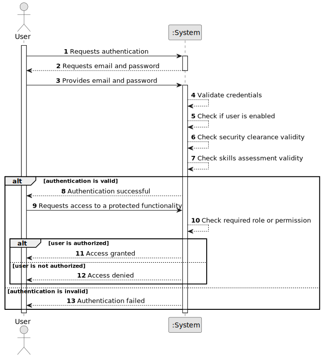

# US030 - Authentication and Authorization

## 1. Requirements Engineering

### 1.1. User Story Description

As a Project Manager, I want the system to support and apply authentication and authorization for all its users and functionalities.

This user story ensures that only authenticated users can access the system and that each authenticated user can only execute functionalities for which they are authorized.

---

### 1.2. Customer Specifications and Clarifications

**From the specifications document:**

* A user is someone with access to the system.
* A user is identified by a unique valid email from the list of valid email domains.
* A user has a name and phone number.
* Users must authenticate into the system to do anything.
* An AlSafe user needs to have an active security clearance that automatically expires at a given date.
* Users need to have periodic skills assessment every 5 years.
* The Admin or the Backoffice Operator can update security clearance and skills assessment information.
* Management has not yet decided if a user can have multiple roles.
* Currently, users do not have multiple roles, but that may happen in the future.
* The number of roles may increase in the future.
* Authentication and authorization must be supported and applied for all users and functionalities.

**From the client clarifications:**

No additional client clarifications are currently available.

---

### 1.3. Acceptance Criteria

* **AC1:** The system must require authentication before allowing access to protected functionalities.
* **AC2:** A user must authenticate using a registered email and valid credentials.
* **AC3:** A disabled user must not be allowed to authenticate.
* **AC4:** A user without an active security clearance must not be allowed to access protected functionalities.
* **AC5:** A user without a valid skills assessment must not be allowed to access protected functionalities.
* **AC6:** The system must verify if the authenticated user has the required role or permission before executing a functionality.
* **AC7:** If authentication fails, the system must display an authentication error message.
* **AC8:** If authorization fails, the system must display an access denied message.
* **AC9:** The authorization model must be prepared to support multiple roles per user in the future.
* **AC10:** Authentication and authorization must be applied consistently across the system.

---

### 1.4. Found out Dependencies

* There must be registered users in the system.
* This user story is related to US031, because users must be registered before they can authenticate.
* This user story is related to US032, because disabled users must not be able to authenticate.
* This user story is related to US033, because the system must list users and their status.
* This user story affects all future functional user stories, because access control must be enforced globally.

---

### 1.5. Input and Output Data

**Input Data:**

* Typed data:
    * Email
    * Password

**Output Data:**

* If authentication is successful:
    * Authentication success message
    * Authenticated user information
    * Available system functionalities according to the user's authorization level

* If authentication fails:
    * Authentication error message

* If authorization fails:
    * Access denied message

---

### 1.6. System Sequence Diagram

**_Other alternatives might exist._**

---

### 1.7. Other Relevant Remarks

* This user story is transversal to the entire system.
* Authentication and authorization should not be implemented separately inside each functionality.
* Authorization should be centralized so that the system remains maintainable as new roles and functionalities are added.
* Although users currently have only one role, the model should not prevent multiple roles in the future.