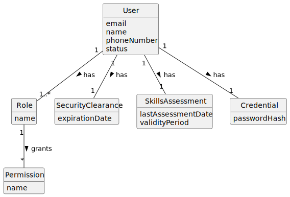

# US030 - Authentication and Authorization

## 2. Analysis

### 2.1. Relevant Domain Concepts

The relevant domain concepts for this user story are:

* **User:** someone with access to the system.
* **Email:** unique identifier used to identify the user.
* **Password:** credential used to authenticate the user.
* **Role:** authorization classification associated with a user.
* **Permission:** action that a user may or may not execute.
* **Security Clearance:** access condition that expires at a given date.
* **Skills Assessment:** periodic assessment that must be renewed every 5 years.
* **User Status:** indicates whether a user is enabled or disabled.

---

### 2.2. Business Rules

* A user must authenticate before using the system.
* A user must be identified by a unique valid email.
* A disabled user cannot authenticate.
* A user with expired security clearance cannot access protected functionalities.
* A user with expired skills assessment cannot access protected functionalities.
* The system must verify if the authenticated user has the required role or permission before executing a protected functionality.
* The system should be prepared to support users with multiple roles in the future.
* Authentication failure and authorization failure must be treated as different situations.

---

### 2.3. Preconditions

* The user must be registered in the system.
* The user must provide credentials.
* The requested functionality must have an associated required role or permission.

---

### 2.4. Postconditions

**Successful authentication:**

* The user is authenticated.
* The system allows the user to request protected functionalities.

**Failed authentication:**

* The user remains unauthenticated.
* No protected functionality is executed.

**Successful authorization:**

* The requested functionality may be executed.

**Failed authorization:**

* The user remains authenticated.
* The requested functionality is not executed.

---

### 2.5. Domain Model

