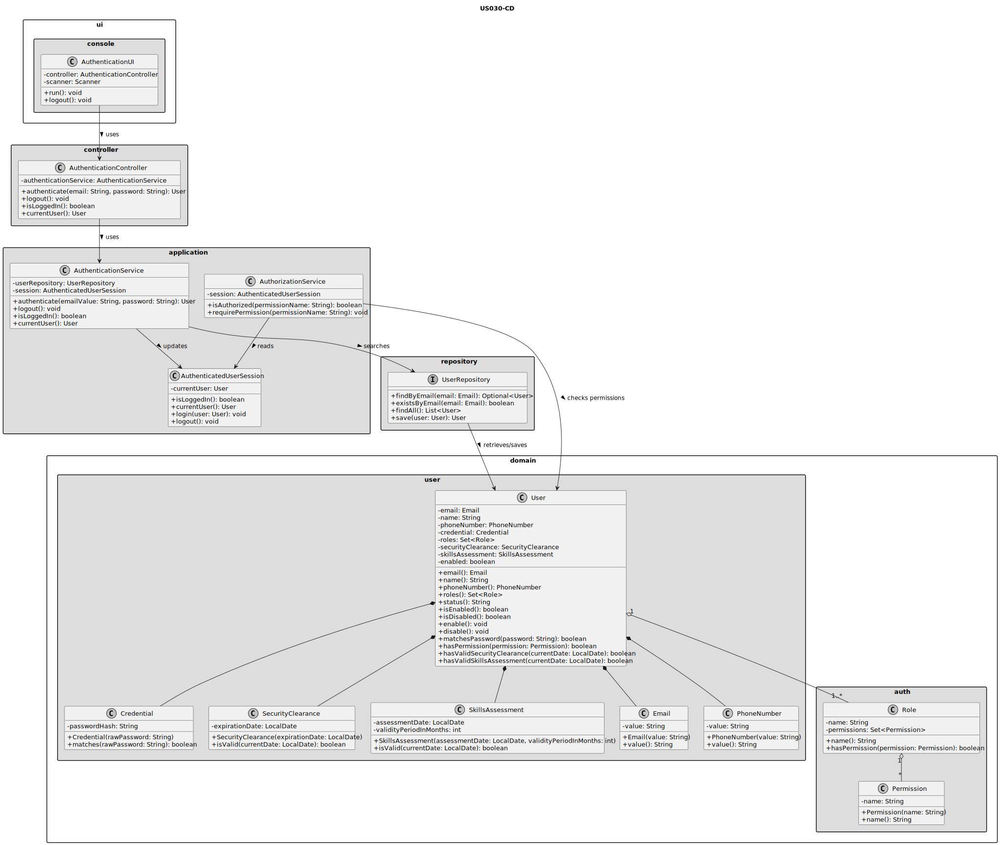
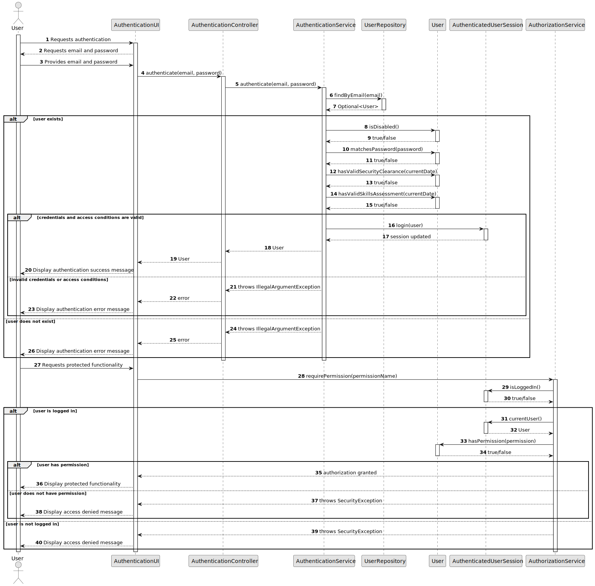

# US030 - Authentication and Authorization

## 3. Design

### 3.1. Responsibility Assignment

The authentication and authorization process is divided between the following components:

* **AuthenticationUI:** interacts with the user and collects credentials.
* **AuthenticationController:** receives the authentication request from the UI.
* **AuthenticationService:** validates credentials and user access conditions.
* **AuthorizationService:** checks if an authenticated user has the required role or permission.
* **UserRepository:** retrieves user information.
* **User:** domain entity that represents a system user.
* **Credential:** domain object responsible for credential validation.
* **Role:** represents the user's authorization level.
* **Permission:** represents an action that may be executed by a user.

---

### 3.2. Class Diagram

---

### 3.3. Sequence Diagram

---

### 3.4. Applied Patterns

* **UI:** responsible for user interaction.
* **Controller:** coordinates requests from the UI.
* **Service:** contains application logic for authentication and authorization.
* **Repository:** abstracts access to user persistence.
* **Entity:** represents domain objects with identity.
* **Value Object:** represents immutable domain values such as email, password and roles.
* **Policy/Guard:** authorization rules should be centralized and reusable.

---

### 3.5. Design Remarks

* The UI must not access the repository directly.
* The controller must not contain business rules.
* Authentication and authorization logic should be centralized in services.
* Passwords should not be stored in plain text.
* The authorization model should avoid assuming that a user has only one role.
* This design should allow the authentication mechanism to be reused by remote TCP clients in future user stories.