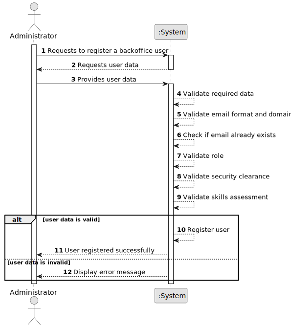

# US031 - Register Users

## 1. Requirements Engineering

### 1.1. User Story Description

As an Administrator, I want to be able to register users of the backoffice.

This functionality allows an Administrator to create new backoffice users in the system. The registration must also be possible through a bootstrap process, so that initial users can be loaded when the system starts or is initialized.

---

### 1.2. Customer Specifications and Clarifications

**From the specifications document:**

* A user is someone with access to the system.
* A user is identified by a unique valid email from the list of valid email domains.
* A user has a name and phone number.
* Users must authenticate into the system to do anything.
* An AlSafe user needs to have an active security clearance that automatically expires at a given date.
* Users need to have periodic skills assessment every 5 years.
* The Admin or the Backoffice Operator can update security clearance and skills assessment information.
* Currently, management has not yet decided if a user can have multiple roles.
* Right now, no user has multiple roles, but that may happen in the future.
* The number of roles may also increase in the future.
* Backoffice users must be registered by an Administrator.
* User registration must also be achievable by a bootstrap process.

**From the client clarifications:**

No additional client clarifications are currently available.

---

### 1.3. Acceptance Criteria

* **AC1:** The Administrator must be able to register a new backoffice user.
* **AC2:** The user email must be valid.
* **AC3:** The user email must be unique in the system.
* **AC4:** The user must have a name.
* **AC5:** The user must have a phone number.
* **AC6:** The user must be assigned at least one role.
* **AC7:** The user must have security clearance information.
* **AC8:** The user must have skills assessment information.
* **AC9:** The system must not register a user if the email is already used.
* **AC10:** The system must not register a user if required data is missing or invalid.
* **AC11:** The system must support registering users through a bootstrap process.
* **AC12:** A successfully registered user must be stored in the system.

---

### 1.4. Found out Dependencies

* This user story depends on US030, because only authorized Administrators should be able to register users.
* This user story is related to US032, because registered users may later be disabled or enabled.
* This user story is related to US033, because registered users must be listable.
* This user story depends on the existence of the User, Role, Security Clearance and Skills Assessment concepts.
* This user story may depend on predefined valid email domains.

---

### 1.5. Input and Output Data

**Input Data:**

* Typed data:
  * Email
  * Name
  * Phone number
  * Security clearance expiration date
  * Last skills assessment date

* Selected data:
  * Role or roles

**Output Data:**

* In case of success:
  * Success message
  * Registered user information

* In case of failure:
  * Error message explaining why the user could not be registered

---

### 1.6. System Sequence Diagram

**_Other alternatives might exist._**

---

### 1.7. Other Relevant Remarks

* The bootstrap process must follow the same validation rules as manual registration.
* The system should not allow duplicated users.
* Password creation policy is not fully detailed in the specification. Until clarified, the system may generate an initial password or require one during registration.
* The design should remain flexible enough to support multiple roles per user in the future.