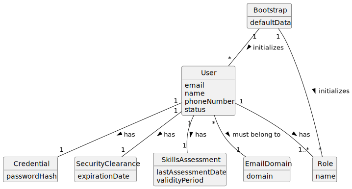

# US031 - Register Users

## 2. Analysis

### 2.1. Relevant Domain Concepts

The relevant domain concepts for this user story are:

* **Administrator:** user responsible for registering backoffice users.
* **User:** person with access to the system.
* **Email:** unique identifier of the user.
* **Phone Number:** contact information associated with the user.
* **Role:** defines the user's access level.
* **Security Clearance:** condition required for access to the system.
* **Skills Assessment:** periodic assessment required by regulation.
* **Bootstrap Process:** initialization mechanism that registers default users automatically.

---

### 2.2. Business Rules

* Only an Administrator can register backoffice users.
* A user must have a unique email.
* A user email must be valid.
* A user must have a name.
* A user must have a phone number.
* A user must have at least one role.
* A user must have security clearance information.
* A user must have skills assessment information.
* A user cannot be registered if another user already has the same email.
* A user registered through bootstrap must obey the same rules as a user registered manually.
* The system should be prepared to support multiple roles per user in the future.

---

### 2.3. Preconditions

* The Administrator must be authenticated.
* The Administrator must be authorized to register users.
* The required user data must be available.
* The selected role or roles must exist in the system.

---

### 2.4. Postconditions

**Successful registration:**

* A new user is created.
* The new user is stored in the system.
* The new user can be listed by the Administrator.
* The new user may later authenticate if enabled and if access conditions are valid.

**Failed registration:**

* No user is created.
* The system state remains unchanged.
* An error message is presented.

---

### 2.5. Domain Model

