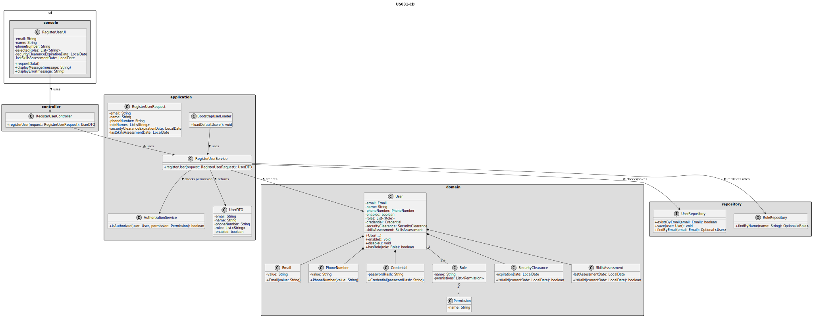
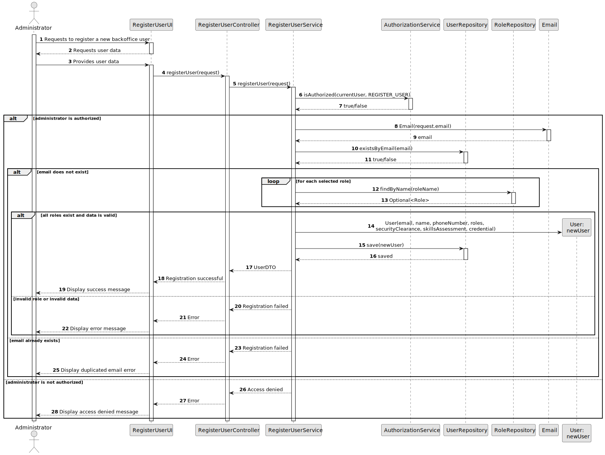

# US031 - Register Users

## 3. Design

### 3.1. Responsibility Assignment

The user registration process is divided between the following components:

* **RegisterUserUI:** interacts with the Administrator and collects the new user's data.
* **RegisterUserController:** receives the registration request from the UI and delegates it to the application service.
* **RegisterUserService:** coordinates authorization, role resolution, user creation and persistence.
* **AuthorizationService:** verifies whether the currently authenticated user has permission to register users.
* **RegisterUserRequest:** carries the data required to register a user.
* **UserRepository:** checks if the email already exists and stores the new user.
* **RoleRepository:** retrieves and validates selected roles.
* **User:** domain entity representing a system user.
* **Email:** value object responsible for email validation.
* **PhoneNumber:** value object responsible for phone number validation.
* **Credential:** domain object responsible for storing and validating user credentials.
* **SecurityClearance:** represents the user's security clearance validity.
* **SkillsAssessment:** represents the user's periodic skills assessment validity.
* **Bootstrap:** initializes default roles, permissions and users when the system starts.

---

### 3.2. Class Diagram

---

### 3.3. Sequence Diagram

---

### 3.4. Applied Patterns

* **UI:** responsible for interacting with the Administrator.
* **Controller:** receives and delegates the registration request.
* **Service:** coordinates authorization, validation, object creation and persistence.
* **Repository:** abstracts persistence operations.
* **Entity:** represents users with identity.
* **Value Object:** represents immutable domain values such as email, phone number and credential.
* **Bootstrap:** supports automatic registration of initial roles, permissions and users.
* **Guard/Policy:** authorization is centralized in `AuthorizationService`.

---

### 3.5. Design Remarks

* The UI must not validate business rules directly.
* The Controller must not access repositories directly if an application service exists.
* User creation is centralized in `RegisterUserService` to guarantee that registration rules are enforced consistently.
* Manual registration and bootstrap registration should obey the same domain rules.
* Password storage should avoid plain text.
* The model supports multiple roles per user through a set of roles.
* The current implementation does not use DTOs; it returns the registered `User` directly.