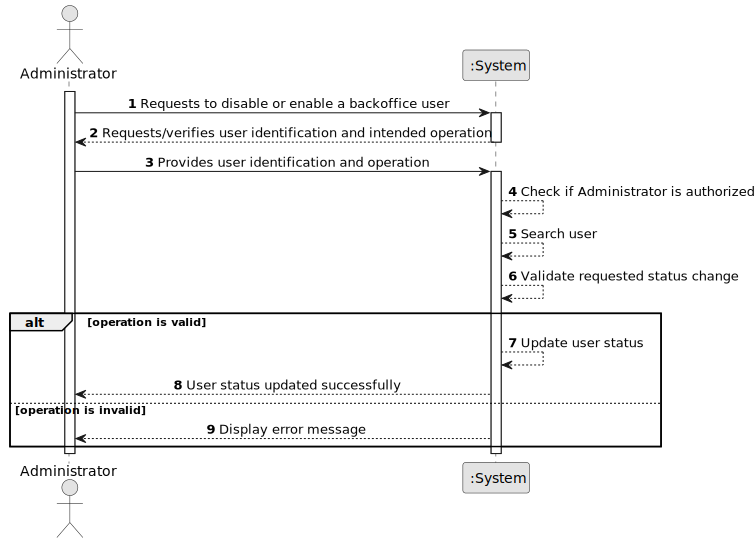

# US032 - Disable/Enable Users

## 1. Requirements Engineering

### 1.1. User Story Description

As an Administrator, I want to be able to disable and enable users of the backoffice.

This functionality allows an Administrator to control whether a backoffice user is allowed to access the system. A disabled user must not be able to authenticate or use protected functionalities.

---

### 1.2. Customer Specifications and Clarifications

**From the specifications document:**

* A user is someone with access to the system.
* A user is identified by a unique valid email from the list of valid email domains.
* A user also has a name and phone number.
* Users must authenticate into the system to do anything.
* An AlSafe user needs to have an active security clearance that automatically expires at a given date.
* Users need to have periodic skills assessment every 5 years.
* The Admin or the Backoffice Operator can update security clearance and skills assessment information.
* As Administrator, it must be possible to disable and enable users of the backoffice.
* Authentication and authorization must be enforced by the system.

**From the client clarifications:**

No additional client clarifications are currently available.

---

### 1.3. Acceptance Criteria

* **AC1:** The Administrator must be able to disable an enabled backoffice user.
* **AC2:** The Administrator must be able to enable a disabled backoffice user.
* **AC3:** A disabled user must not be able to authenticate.
* **AC4:** The system must not disable a user that does not exist.
* **AC5:** The system must not enable a user that does not exist.
* **AC6:** The system must inform the Administrator when the operation succeeds.
* **AC7:** The system must display an error message when the operation cannot be performed.
* **AC8:** Only an authorized Administrator can disable or enable users.
* **AC9:** Disabling a user must not delete the user from the system.
* **AC10:** Enabling a user must restore the user's ability to authenticate, provided all other access conditions are valid.

---

### 1.4. Found out Dependencies

* This user story depends on US030, because only authenticated and authorized Administrators should be able to perform this operation.
* This user story depends on US031, because users must exist before they can be disabled or enabled.
* This user story is related to US033, because listed users should include their status.
* This user story affects authentication, because disabled users must not be allowed to authenticate.

---

### 1.5. Input and Output Data

**Input Data:**

* Selected data:
  * User to disable or enable

* Typed data:
  * User email, if the user is searched by email

**Output Data:**

* In case of success:
  * Success message
  * Updated user status

* In case of failure:
  * Error message explaining why the operation could not be completed

---

### 1.6. System Sequence Diagram

**_Other alternatives might exist._**

---

### 1.7. Other Relevant Remarks

* Disabling a user is not the same as deleting a user.
* Disabled users should remain stored in the system for auditability and future reactivation.
* Enabling a user should not bypass security clearance or skills assessment validation.
* A user may be enabled but still unable to access the system if their security clearance or skills assessment is expired.