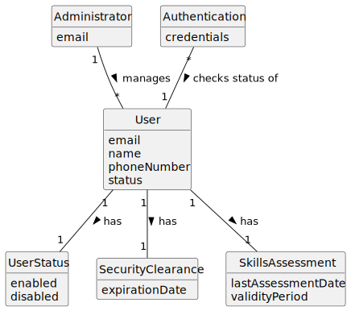

# US032 - Disable/Enable Users

## 2. Analysis

### 2.1. Relevant Domain Concepts

The relevant domain concepts for this user story are:

* **Administrator:** user responsible for managing backoffice users.
* **User:** person with access to the system.
* **User Status:** indicates whether the user is enabled or disabled.
* **Email:** unique identifier used to find the user.
* **Authentication:** process affected by the user's status.
* **Authorization:** rule that determines whether the Administrator can execute the operation.

---

### 2.2. Business Rules

* Only an authorized Administrator can disable or enable backoffice users.
* A user must exist in order to be disabled or enabled.
* A disabled user cannot authenticate.
* Disabling a user must not remove the user from the system.
* Enabling a user changes the user's status to enabled.
* An enabled user can only access the system if all other access conditions are valid.
* The system must keep the user information after disabling the user.
* The system should report failure if the requested user does not exist.

---

### 2.3. Preconditions

* The Administrator must be authenticated.
* The Administrator must be authorized to manage users.
* The target user must already be registered in the system.

---

### 2.4. Postconditions

**Successful disable operation:**

* The target user status is changed to disabled.
* The target user can no longer authenticate.

**Successful enable operation:**

* The target user status is changed to enabled.
* The target user may authenticate if credentials, security clearance and skills assessment are valid.

**Failed operation:**

* The target user status remains unchanged.
* The system displays an error message.

---

### 2.5. Domain Model

