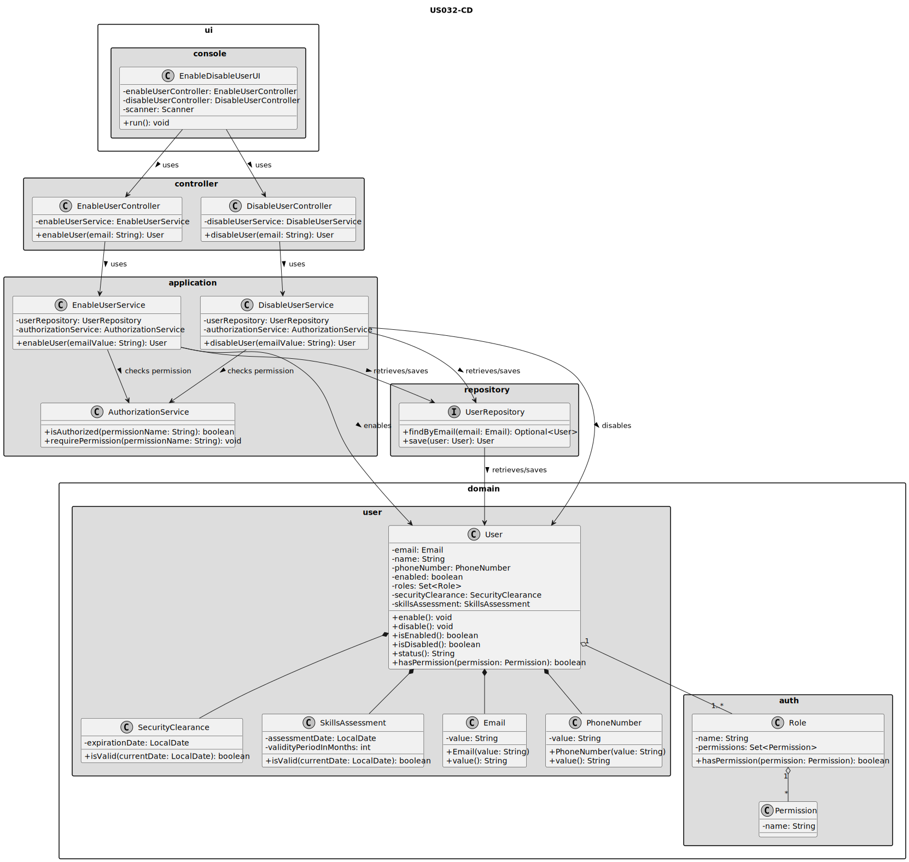
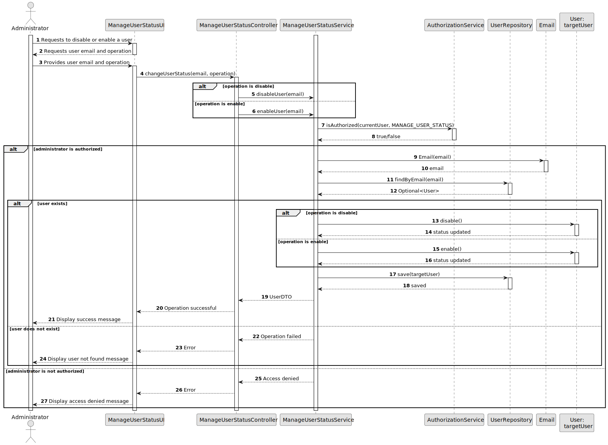

# US032 - Disable/Enable Users

## 3. Design

### 3.1. Responsibility Assignment

The disable/enable user process is divided between the following components:

* **EnableDisableUserUI:** interacts with the Administrator and collects the target user email and intended operation.
* **EnableUserController:** receives enable requests from the UI and delegates them to the application service.
* **DisableUserController:** receives disable requests from the UI and delegates them to the application service.
* **EnableUserService:** checks authorization, retrieves the target user and enables it.
* **DisableUserService:** checks authorization, retrieves the target user and disables it.
* **AuthorizationService:** verifies whether the currently authenticated user has permission to enable or disable users.
* **UserRepository:** retrieves and saves the target user.
* **User:** domain entity responsible for changing its own status.

---

### 3.2. Class Diagram

---

### 3.3. Sequence Diagram

---

### 3.4. Applied Patterns

* **UI:** responsible for user interaction.
* **Controller:** receives requests and delegates application logic.
* **Service:** coordinates authorization, user lookup and status update.
* **Repository:** abstracts persistence operations.
* **Entity:** `User` owns its status-changing behavior.
* **Value Object:** `Email` identifies the target user.
* **Authorization Guard:** access to this operation is checked before changing user state.

---

### 3.5. Design Remarks

* The UI must not change the user status directly.
* The Controller must not access persistence directly.
* The User entity exposes `enable()` and `disable()` methods.
* Disabling a user does not remove it from the repository.
* Authorization is checked before modifying the target user.
* This functionality is consistent with authentication rules from US030.
* The current implementation does not use DTOs; it returns the updated `User` directly.