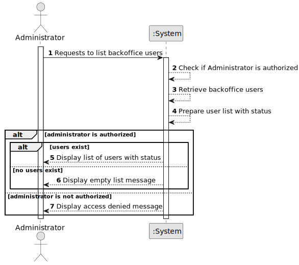

# US033 - List Users

## 1. Requirements Engineering

### 1.1. User Story Description

As an Administrator, I want to be able to list the users of the backoffice, including their status.

This functionality allows the Administrator to consult the registered backoffice users and verify whether each user is currently enabled or disabled.

---

### 1.2. Customer Specifications and Clarifications

**From the specifications document:**

* A user is someone with access to the system.
* A user is identified by a unique valid email from the list of valid email domains.
* A user also has a name and phone number.
* Users must authenticate into the system to do anything.
* An AlSafe user needs to have an active security clearance that automatically expires at a given date.
* Users need to have periodic skills assessment every 5 years.
* The Admin or the Backoffice Operator can update security clearance and skills assessment information.
* As Administrator, it must be possible to list the users of the backoffice, including their status.
* Authentication and authorization must be enforced by the system.

**From the client clarifications:**

No additional client clarifications are currently available.

---

### 1.3. Acceptance Criteria

* **AC1:** The Administrator must be able to list all backoffice users.
* **AC2:** The list must include each user's email.
* **AC3:** The list must include each user's name.
* **AC4:** The list must include each user's phone number.
* **AC5:** The list must include each user's status.
* **AC6:** The system must distinguish enabled users from disabled users.
* **AC7:** Only an authorized Administrator can list backoffice users.
* **AC8:** If there are no registered backoffice users, the system must display an appropriate empty list message.
* **AC9:** The listing operation must not modify user data.
* **AC10:** If the current user is not authorized, the system must display an access denied message.

---

### 1.4. Found out Dependencies

* This user story depends on US030, because only authenticated and authorized Administrators should be able to list users.
* This user story is related to US031, because users must be registered before they can be listed.
* This user story is related to US032, because the listed user status reflects whether each user is enabled or disabled.
* This user story depends on the User concept in the domain model.

---

### 1.5. Input and Output Data

**Input Data:**

* No mandatory typed data is required.

**Optional Input Data:**

* Filtering criteria, if later supported:
  * Status
  * Role
  * Email
  * Name

**Output Data:**

* List of backoffice users, including:
  * Email
  * Name
  * Phone number
  * Status
  * Role or roles

* In case of failure:
  * Error message explaining why the list cannot be displayed

---

### 1.6. System Sequence Diagram

**_Other alternatives might exist._**

---

### 1.7. Other Relevant Remarks

* This user story is read-only.
* Listing users must not change the system state.
* Disabled users should still appear in the list, because the user story explicitly requires user status to be visible.
* The initial implementation may list all users without filters.
* Filtering and sorting may be added later if needed.