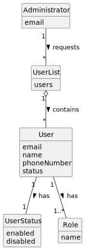

# US033 - List Users

## 2. Analysis

### 2.1. Relevant Domain Concepts

The relevant domain concepts for this user story are:

* **Administrator:** user responsible for managing and consulting backoffice users.
* **User:** person with access to the system.
* **Email:** unique identifier of the user.
* **Name:** human-readable identification of the user.
* **Phone Number:** contact information associated with the user.
* **User Status:** indicates whether the user is enabled or disabled.
* **Role:** indicates the user's authorization level.

---

### 2.2. Business Rules

* Only an authorized Administrator can list backoffice users.
* The system must include user status in the list.
* Enabled and disabled users must both be visible.
* The listing operation must not modify user data.
* If no users exist, the system must return an empty list or an appropriate message.
* User information should be presented in a clear and understandable way.

---

### 2.3. Preconditions

* The Administrator must be authenticated.
* The Administrator must be authorized to list users.
* The user repository must be accessible.

---

### 2.4. Postconditions

**Successful listing:**

* The system displays the list of backoffice users.
* The system state remains unchanged.

**No registered users:**

* The system displays an empty list message.
* The system state remains unchanged.

**Failed authorization:**

* No user list is displayed.
* The system state remains unchanged.
* An access denied message is shown.

---

### 2.5. Domain Model

