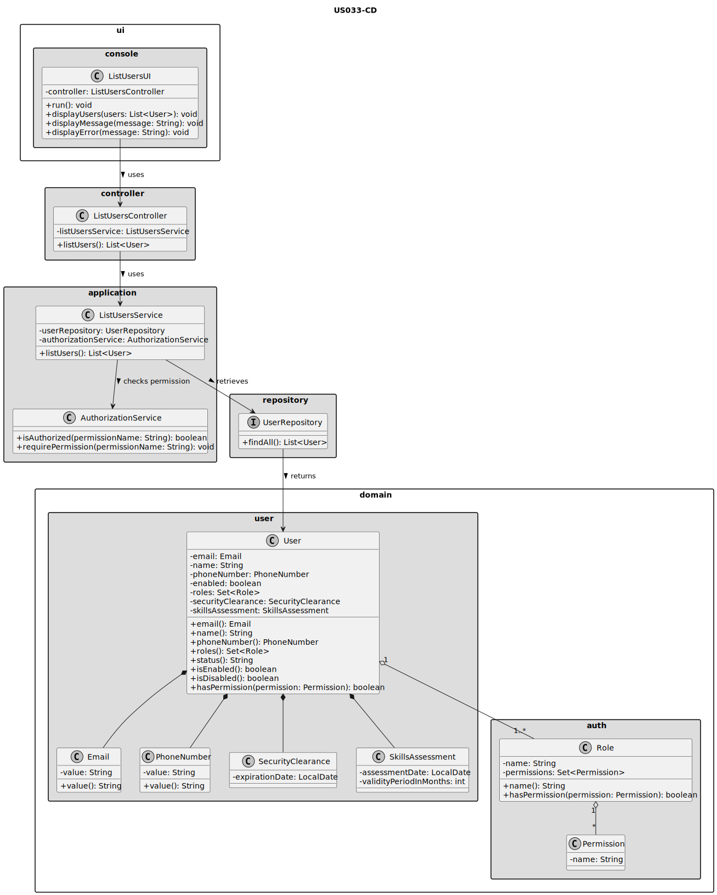
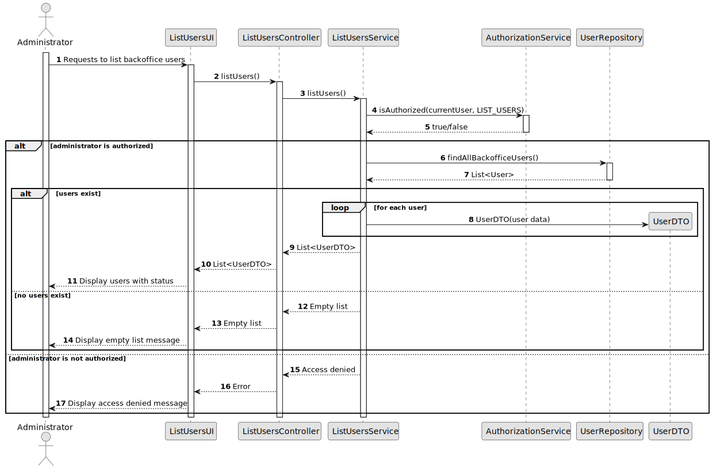

# US033 - List Users

## 3. Design

### 3.1. Responsibility Assignment

The list users process is divided between the following components:

* **ListUsersUI:** interacts with the Administrator and displays the list of users.
* **ListUsersController:** receives the request from the UI.
* **ListUsersService:** coordinates authorization and user retrieval.
* **AuthorizationService:** verifies if the current user has permission to list users.
* **UserRepository:** retrieves the registered backoffice users.
* **UserDTO:** transports user information to the UI without exposing internal domain details.
* **User:** domain entity representing a system user.

---

### 3.2. Class Diagram

---

### 3.3. Sequence Diagram

---

### 3.4. Applied Patterns

* **UI:** responsible for interacting with the Administrator and displaying results.
* **Controller:** receives the list request and delegates application logic.
* **Service:** coordinates authorization and retrieval of users.
* **Repository:** abstracts access to stored users.
* **DTO:** transfers user data to the UI safely.
* **Entity:** represents users in the domain model.

---

### 3.5. Design Remarks

* The UI must not access the repository directly.
* The listing operation should not modify users.
* The system should return DTOs instead of exposing domain objects directly.
* Disabled users must not be filtered out by default, because their status must be visible to the Administrator.
* Filters may be introduced later without changing the main domain model.