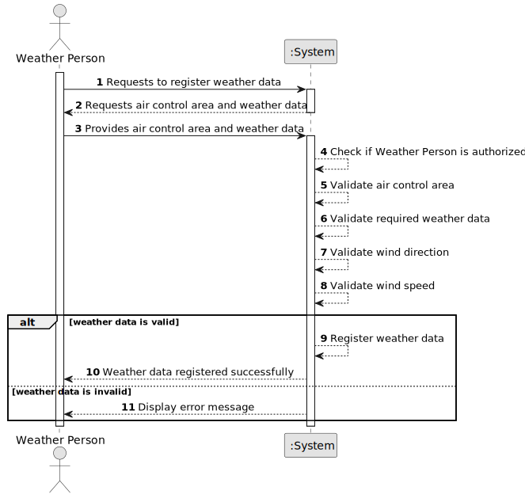

# US041 - Register Weather Data

## 1. Requirements Engineering

### 1.1. User Story Description

As a Weather Person, I want to register weather data in the system for a specific air control area.

This functionality allows a Weather Person to manually register weather information associated with an air control area, so that the system can later use that information for consultation, flight validation and flight simulation.

---

### 1.2. Customer Specifications and Clarifications

**From the specifications document:**

* The system includes a weather service.
* The weather service is intended to be used by all system instances.
* In the beginning, simplified weather information may be used.
* The final prototype must use actual weather forecast information from the AI weather service.
* A Weather Person must be able to register weather data in the system for a specific air control area.
* Weather data is relevant for flight simulation and environmental influence over flights.
* Authentication and authorization must be enforced for all users and functionalities.

**From the client clarifications:**

No additional client clarifications are currently available.

---

### 1.3. Acceptance Criteria

* **AC1:** The Weather Person must be able to register weather data for a specific air control area.
* **AC2:** The selected air control area must exist in the system.
* **AC3:** The weather data must be associated with a date or date/time reference.
* **AC4:** The weather data must include wind direction.
* **AC5:** The weather data must include wind speed.
* **AC6:** Wind speed must be a valid numeric value.
* **AC7:** Wind direction must be a valid angle.
* **AC8:** The system must not register weather data if required fields are missing.
* **AC9:** The system must not register weather data for a non-existing air control area.
* **AC10:** Only an authenticated and authorized Weather Person can register weather data.
* **AC11:** A successfully registered weather data record must be stored in the system.
* **AC12:** The system must display an appropriate success or error message.

---

### 1.4. Found out Dependencies

* This user story depends on US030, because only authenticated and authorized users should be able to access this functionality.
* This user story depends on US050, because weather data must be registered for an existing air control area.
* This user story is related to US042, because bulk weather import should register weather data using compatible rules.
* This user story is related to US043, because registered weather data must later be consultable.
* This user story is related to US110, because environmental influences such as wind are later used in simulation.

---

### 1.5. Input and Output Data

**Input Data:**

* Selected data:
  * Air control area

* Typed data:
  * Date or date/time
  * Wind direction
  * Wind speed

**Optional Input Data:**

Depending on future refinement, the weather data may also include:

* Temperature
* Atmospheric pressure
* Humidity
* Visibility
* Weather source
* Forecast confidence

**Output Data:**

* In case of success:
  * Success message
  * Registered weather data information

* In case of failure:
  * Error message explaining why the weather data could not be registered

---

### 1.6. System Sequence Diagram

**_Other alternatives might exist._**

---

### 1.7. Other Relevant Remarks

* The first implementation may use simplified weather data.
* The design should remain extensible to support additional weather attributes later.
* The design should also support future integration with external weather providers and the AI weather service.
* Weather data should be associated with an air control area and a time reference.
* The same validation rules should be reusable by US042 when importing bulk weather data.