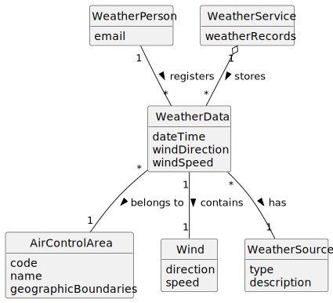

# US041 - Register Weather Data

## 2. Analysis

### 2.1. Relevant Domain Concepts

The relevant domain concepts for this user story are:

* **Weather Person:** user responsible for registering weather data.
* **Weather Data:** meteorological information associated with an air control area and a time reference.
* **Air Control Area:** geographic area for which weather data is registered.
* **Wind Direction:** direction from which or towards which the wind is moving, represented as an angle.
* **Wind Speed:** speed of the wind, represented as a numeric value.
* **Weather Source:** origin of the weather information, which may be manual, CSV import or external provider in the future.
* **Weather Service:** system component responsible for storing and providing weather data.

---

### 2.2. Business Rules

* Only an authorized Weather Person can register weather data.
* Weather data must be associated with an existing air control area.
* Weather data must have a date or date/time reference.
* Weather data must include valid wind information.
* Wind speed cannot be negative.
* Wind direction must be a valid angle.
* Required weather fields cannot be empty.
* The system must store successfully registered weather data.
* The system should be extensible to support additional weather attributes in the future.
* Manually registered weather data and imported weather data should follow compatible validation rules.

---

### 2.3. Preconditions

* The Weather Person must be authenticated.
* The Weather Person must be authorized to register weather data.
* The target air control area must exist in the system.
* Required weather data must be available.

---

### 2.4. Postconditions

**Successful registration:**

* A new weather data record is created.
* The weather data is associated with the selected air control area.
* The weather data can later be consulted.
* The weather data may later be used in flight validation or simulation.

**Failed registration:**

* No weather data record is created.
* The system state remains unchanged.
* An error message is displayed.

---

### 2.5. Domain Model

