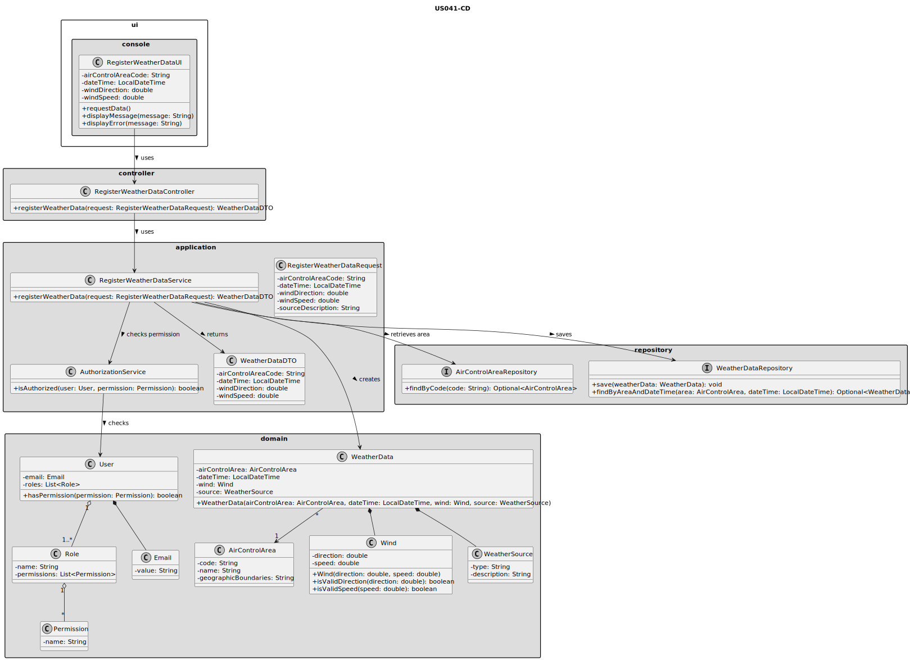
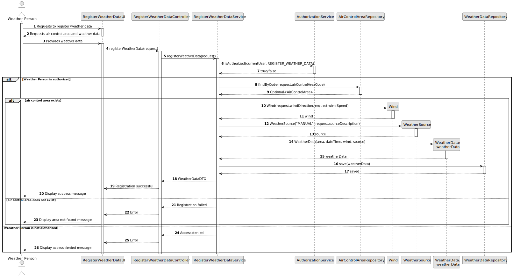

# US041 - Register Weather Data

## 3. Design

### 3.1. Responsibility Assignment

The weather data registration process is divided between the following components:

* **RegisterWeatherDataUI:** interacts with the Weather Person and collects the weather data.
* **RegisterWeatherDataController:** receives the registration request from the UI.
* **RegisterWeatherDataService:** coordinates authorization, validation and persistence.
* **AuthorizationService:** verifies if the current user has permission to register weather data.
* **AirControlAreaRepository:** verifies if the selected air control area exists.
* **WeatherDataRepository:** stores the registered weather data.
* **WeatherData:** domain entity representing the registered weather information.
* **Wind:** domain object representing wind direction and speed.
* **WeatherSource:** represents the origin of the weather data.

---

### 3.2. Class Diagram

---

### 3.3. Sequence Diagram

---

### 3.4. Applied Patterns

* **UI:** responsible for collecting input from the Weather Person.
* **Controller:** receives the request and delegates the operation.
* **Service:** coordinates the use case and application rules.
* **Repository:** abstracts access to stored air control areas and weather data.
* **Entity:** represents weather data with identity and persistence.
* **Value Object:** represents values such as wind direction and wind speed.
* **DTO/Request Object:** transfers input data from the UI to the application service.

---

### 3.5. Design Remarks

* The UI must not access repositories directly.
* The Controller should not contain business rules.
* The Service should coordinate authorization and persistence.
* Weather validation should be centralized in domain objects where possible.
* `Wind` should protect its own invariants, such as valid direction and non-negative speed.
* The design should allow future extensions for temperature, pressure, humidity, visibility and external provider metadata.
* The same validation rules should later be reused by bulk import functionality.