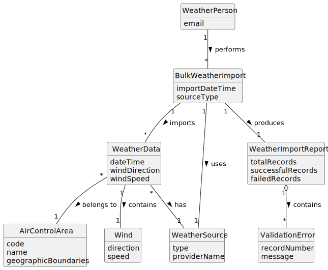

# US042 - Import Bulk Weather Data

## 2. Analysis

### 2.1. Relevant Domain Concepts

The relevant domain concepts for this user story are:

* **Weather Person:** user responsible for importing weather data.
* **Weather Data:** meteorological information associated with an air control area and a time reference.
* **Bulk Weather Import:** operation that imports multiple weather records at once.
* **Weather Data Source:** origin of the imported data, such as CSV file or external provider.
* **CSV Weather Source:** initial file-based source supported by the system.
* **Weather Import Report:** summary of the import result, including successful and failed records.
* **Air Control Area:** geographic area associated with each weather data record.
* **Wind:** weather component containing direction and speed.
* **Validation Error:** information describing why a record could not be imported.

---

### 2.2. Business Rules

* Only an authorized Weather Person can import bulk weather data.
* The initial supported import format is CSV.
* The system must validate the file format before processing records.
* Each weather record must be validated individually.
* A weather record must reference an existing air control area.
* A weather record must include a valid date or date/time.
* A weather record must include valid wind data.
* Wind speed cannot be negative.
* Wind direction must be a valid angle.
* Invalid records must not be stored.
* Valid records may be stored even if other records in the same import fail validation.
* The system must produce an import report.
* The import design should allow adding new weather data source types in the future.

---

### 2.3. Preconditions

* The Weather Person must be authenticated.
* The Weather Person must be authorized to import weather data.
* The file or source must be available.
* Referenced air control areas must already exist in the system.

---

### 2.4. Postconditions

**Successful import:**

* Valid weather records are created.
* Valid weather records are associated with their air control areas.
* The imported weather data can later be consulted.
* The system displays an import report.

**Partial import:**

* Valid weather records are stored.
* Invalid records are rejected.
* The system displays an import report containing validation errors.

**Failed import:**

* No weather data records are stored if the file itself is invalid or unreadable.
* The system displays an error message.
* The system state remains unchanged.

---

### 2.5. Domain Model

