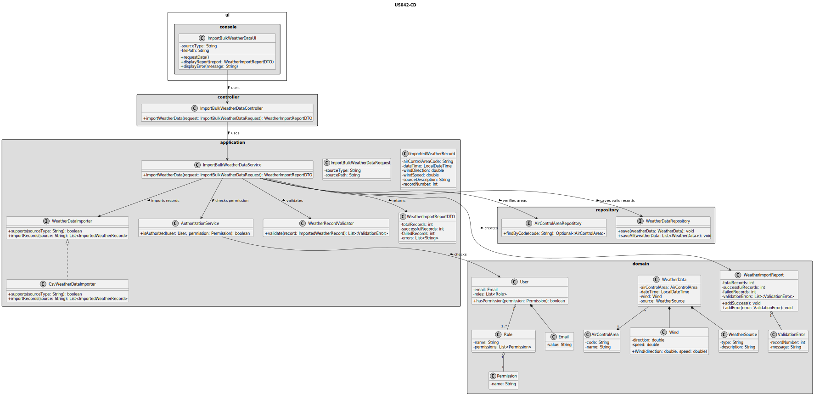
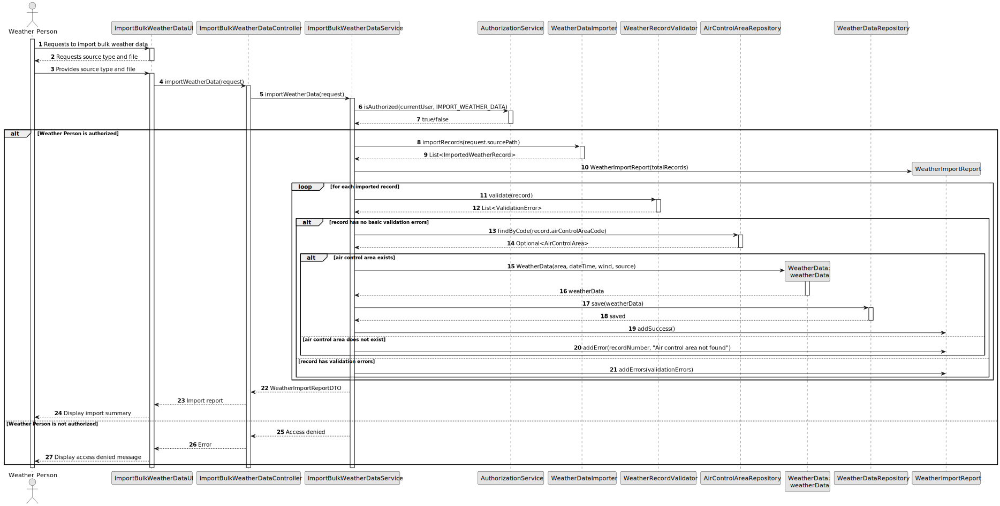

# US042 - Import Bulk Weather Data

## 3. Design

### 3.1. Responsibility Assignment

The bulk weather data import process is divided between the following components:

* **ImportBulkWeatherDataUI:** interacts with the Weather Person and collects the file/source to import.
* **ImportBulkWeatherDataController:** receives the import request from the UI.
* **ImportBulkWeatherDataService:** coordinates authorization, parsing, validation, persistence and report generation.
* **AuthorizationService:** verifies if the current user has permission to import weather data.
* **WeatherDataImporter:** generic interface for importing weather records from a source.
* **CsvWeatherDataImporter:** concrete importer for CSV files.
* **WeatherRecordParser:** transforms raw source data into intermediate weather records.
* **WeatherRecordValidator:** validates imported weather records.
* **AirControlAreaRepository:** verifies that referenced air control areas exist.
* **WeatherDataRepository:** stores valid weather data records.
* **WeatherImportReport:** summarizes the import result.

---

### 3.2. Class Diagram

---

### 3.3. Sequence Diagram

---

### 3.4. Applied Patterns

* **UI:** responsible for collecting the import request from the Weather Person.
* **Controller:** receives and delegates the import request.
* **Service:** coordinates the import use case.
* **Repository:** abstracts persistence and lookup operations.
* **Strategy:** allows different weather importers, such as CSV or external provider importers.
* **DTO/Request Object:** transfers import input data.
* **Report Object:** represents the import result.
* **Validator:** centralizes validation of imported weather records.
* **Factory/Mapper:** may be used to transform parsed records into domain objects.

---

### 3.5. Design Remarks

* The UI must not parse files directly.
* The Controller should not contain import logic.
* The Service should coordinate the import process but delegate source-specific parsing to an importer.
* CSV support should be implemented as the first concrete importer.
* Future weather providers should be added by implementing the same importer abstraction.
* Validation rules should be compatible with the rules used by US041.
* Invalid records should not be persisted.
* The import result should clearly distinguish successful and failed records.