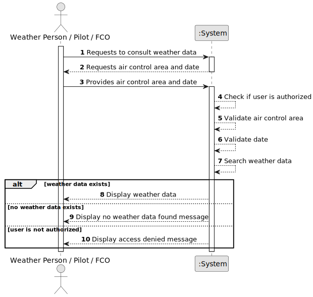

# US043 - Consult Weather Data

## 1. Requirements Engineering

### 1.1. User Story Description

As a Weather Person, a Pilot, or a Flight Control Operator, I want to consult weather data in the system in a given day and in a specific air control area.

This functionality allows authorized users to retrieve weather information associated with an air control area and a specific date. The retrieved weather data may support flight planning, flight validation and flight control simulation.

---

### 1.2. Customer Specifications and Clarifications

**From the specifications document:**

* The system includes a weather service.
* The weather service is intended to be used by all system instances.
* In the beginning, simplified weather information may be used.
* The final prototype must use actual weather forecast information from the AI weather service.
* Weather data may be registered manually.
* Weather data may be imported in bulk from multiple external weather service providers.
* A Weather Person, a Pilot, or a Flight Control Operator must be able to consult weather data in a given day and in a specific air control area.
* Weather information may later be used for flight validation and simulation.
* Authentication and authorization must be enforced.

**From the client clarifications:**

No additional client clarifications are currently available.

---

### 1.3. Acceptance Criteria

* **AC1:** An authorized Weather Person must be able to consult weather data.
* **AC2:** An authorized Pilot must be able to consult weather data.
* **AC3:** An authorized Flight Control Operator must be able to consult weather data.
* **AC4:** The user must select or provide an existing air control area.
* **AC5:** The user must provide a valid date.
* **AC6:** The system must retrieve weather data for the selected air control area and date.
* **AC7:** The system must display the weather data in a clear format.
* **AC8:** If no weather data exists for the selected criteria, the system must display an appropriate message.
* **AC9:** The system must not modify weather data during consultation.
* **AC10:** Unauthorized users must not be allowed to consult weather data.
* **AC11:** The displayed weather data must include at least wind direction and wind speed.
* **AC12:** The displayed weather data should include source/provider information when available.

---

### 1.4. Found out Dependencies

* This user story depends on US030, because only authenticated and authorized users should be able to access this functionality.
* This user story depends on US041 and US042, because weather data must be registered or imported before it can be consulted.
* This user story depends on US050, because weather data is associated with an air control area.
* This user story is related to US080, US082 and US085, because flight plans may use weather data.
* This user story is related to US100 and US110, because simulations may use weather data as environmental input.

---

### 1.5. Input and Output Data

**Input Data:**

* Selected data:
    * Air control area

* Typed data:
    * Date

**Optional Input Data:**

Depending on future refinement, the consultation may also support:

* Time interval
* Weather source/provider
* Forecast type
* Specific weather parameter

**Output Data:**

* In case weather data exists:
    * Air control area code
    * Date or date/time
    * Wind direction
    * Wind speed
    * Weather source/provider, if available
    * Additional weather attributes, if available

* In case no weather data exists:
    * Message indicating that no weather data was found

* In case of failure:
    * Error message explaining why consultation could not be completed

---

### 1.6. System Sequence Diagram

**_Other alternatives might exist._**

---

### 1.7. Other Relevant Remarks

* This is a read-only user story.
* Consultation must not modify weather data.
* The first implementation may consult simplified weather data.
* The design should support future weather information coming from different providers.
* The same functionality may later be exposed through remote access mechanisms.