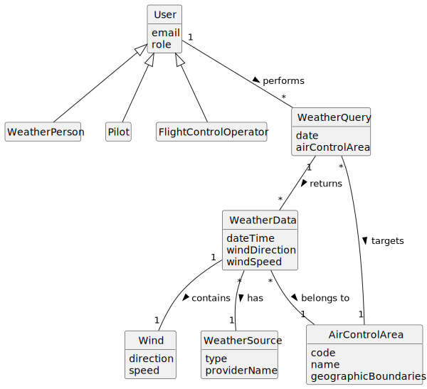

# US043 - Consult Weather Data

## 2. Analysis

### 2.1. Relevant Domain Concepts

The relevant domain concepts for this user story are:

* **Weather Person:** user who can register, import and consult weather data.
* **Pilot:** user who may consult weather data for flight planning or validation.
* **Flight Control Operator:** user who may consult weather data for air control and simulation.
* **Weather Data:** meteorological information associated with an air control area and time reference.
* **Air Control Area:** geographic area used as consultation criterion.
* **Weather Query:** criteria used to search weather data.
* **Weather Source:** origin of the weather data.
* **Wind:** meteorological component containing direction and speed.

---

### 2.2. Business Rules

* Only authorized users can consult weather data.
* Weather Person, Pilot and Flight Control Operator may consult weather data.
* The air control area must exist.
* The consultation date must be valid.
* The system must search weather data by air control area and date.
* If no data exists for the selected criteria, the system must inform the user.
* Consultation must not modify weather data.
* Weather data must display at least wind direction and wind speed.
* Weather source should be displayed when available.

---

### 2.3. Preconditions

* The user must be authenticated.
* The user must be authorized to consult weather data.
* The selected air control area must exist.
* The consultation date must be provided.

---

### 2.4. Postconditions

**Successful consultation with data:**

* The weather data matching the criteria is displayed.
* The system state remains unchanged.

**Successful consultation without data:**

* A no data found message is displayed.
* The system state remains unchanged.

**Failed consultation:**

* No weather data is displayed.
* The system state remains unchanged.
* An error message is displayed.

---

### 2.5. Domain Model

