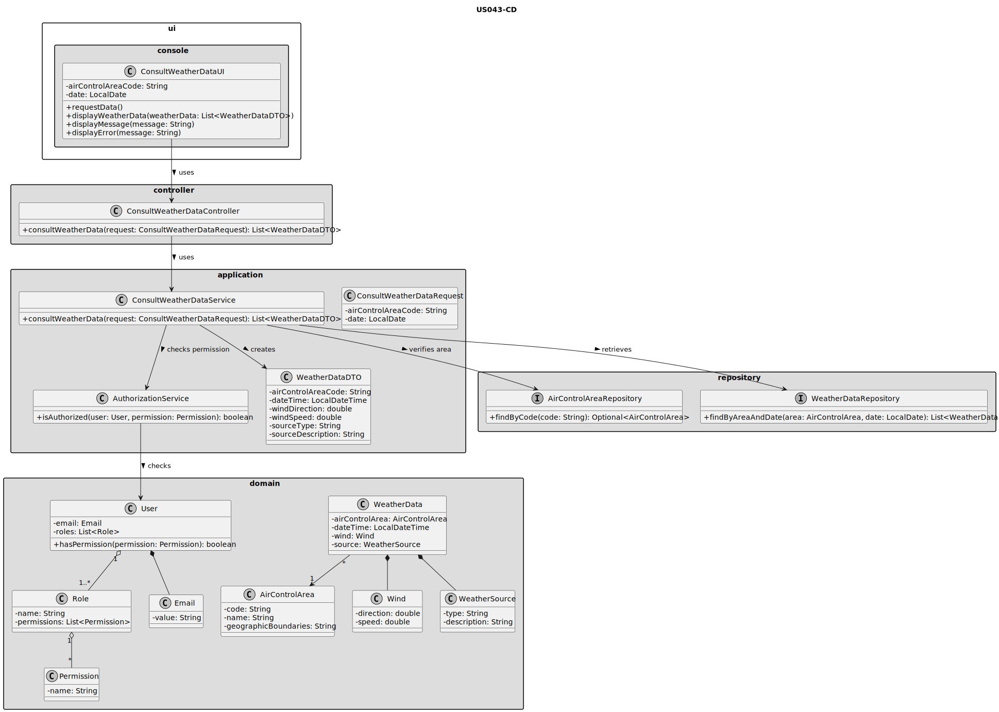
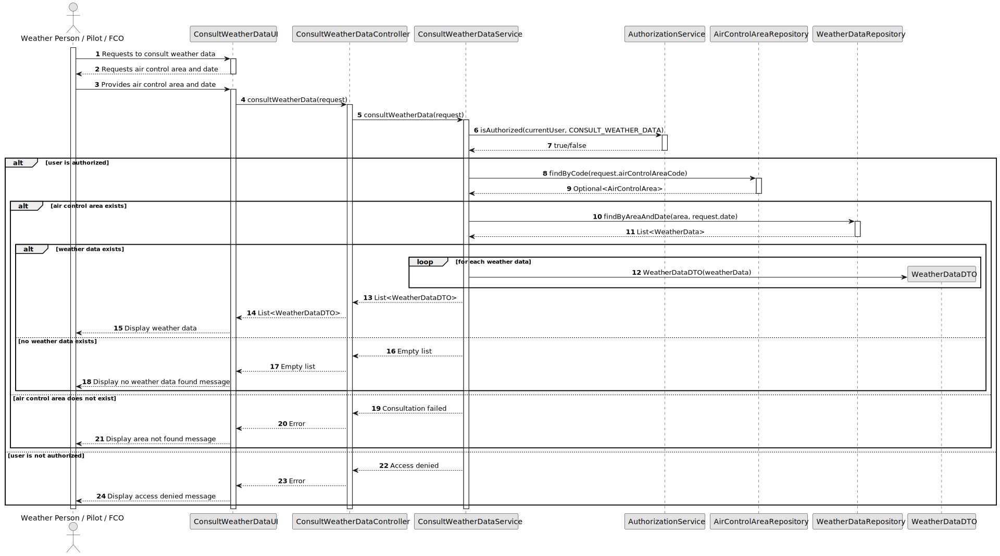

# US043 - Consult Weather Data

## 3. Design

### 3.1. Responsibility Assignment

The weather data consultation process is divided between the following components:

* **ConsultWeatherDataUI:** interacts with the user and collects the consultation criteria.
* **ConsultWeatherDataController:** receives the consultation request from the UI.
* **ConsultWeatherDataService:** coordinates authorization, validation and retrieval of weather data.
* **AuthorizationService:** verifies if the current user has permission to consult weather data.
* **AirControlAreaRepository:** verifies if the selected air control area exists.
* **WeatherDataRepository:** retrieves matching weather data.
* **WeatherDataDTO:** transports weather data to the UI.
* **WeatherData:** domain entity representing weather information.

---

### 3.2. Class Diagram

---

### 3.3. Sequence Diagram

---

### 3.4. Applied Patterns

* **UI:** responsible for collecting consultation criteria and displaying results.
* **Controller:** receives and delegates the request.
* **Service:** coordinates authorization, validation and retrieval.
* **Repository:** abstracts access to stored weather data and air control areas.
* **DTO:** transfers weather data to the UI without exposing domain internals.
* **Query Object:** may represent consultation criteria.

---

### 3.5. Design Remarks

* This functionality must be read-only.
* The UI must not access repositories directly.
* The Controller should not contain business rules.
* The Service should coordinate authorization and lookup.
* The repository should support searching by air control area and date.
* The design should allow future filtering by time interval or provider.
* The returned data should include source information whenever available.