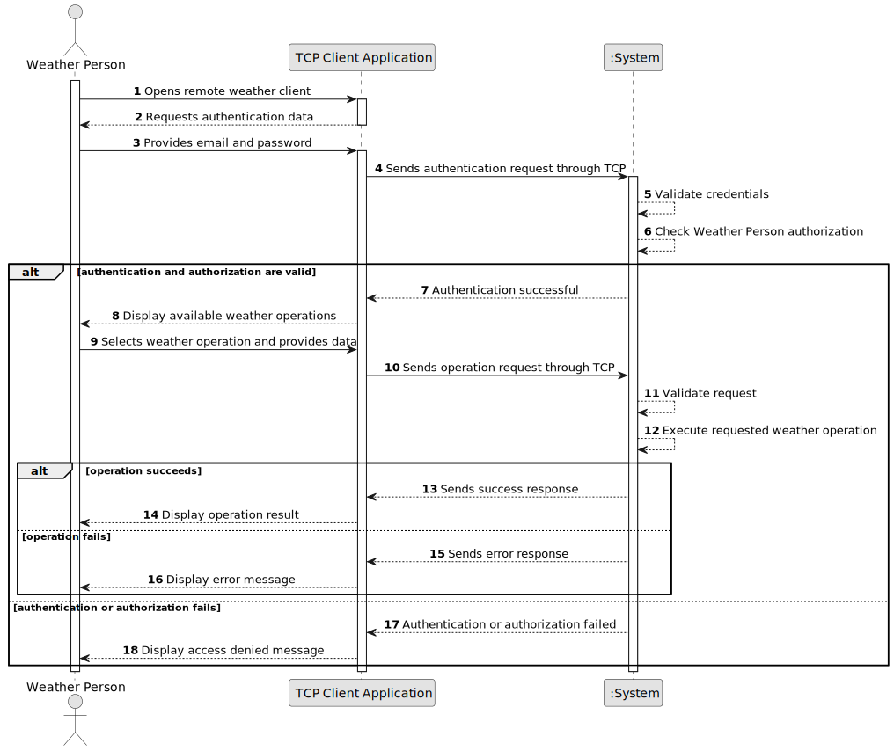

# US044 - Weather Person Remote Access

## 1. Requirements Engineering

### 1.1. User Story Description

As a Weather Person, I want to remotely access the system in order to upload weather data.

This functionality allows a Weather Person to use a specific TCP-based client application to access the weather service remotely. The remote client must allow the Weather Person to execute the weather-related operations available in the system, without directly interacting with the database.

---

### 1.2. Customer Specifications and Clarifications

**From the specifications document:**

* A Weather Person must be able to remotely access the system in order to upload weather data.
* A specific TCP-based network client application is required to communicate with the server application embedded in the system.
* The client application interaction with the system must be limited to the TCP connection.
* Any direct interaction with the database is unacceptable.
* All Weather Person user stories must be remotely available by using this client application.
* Authentication and authorization must be enforced.
* The Weather Person user stories include registering weather data, importing bulk weather data and consulting weather data.

**From the client clarifications:**

No additional client clarifications are currently available.

---

### 1.3. Acceptance Criteria

* **AC1:** The Weather Person must be able to access the system through a TCP-based client application.
* **AC2:** The TCP client must communicate with a server application embedded in the system.
* **AC3:** The TCP client must not directly access the database.
* **AC4:** The Weather Person must authenticate through the remote client.
* **AC5:** The system must enforce authorization for remote Weather Person operations.
* **AC6:** The remote client must allow the Weather Person to register weather data.
* **AC7:** The remote client must allow the Weather Person to import bulk weather data.
* **AC8:** The remote client must allow the Weather Person to consult weather data.
* **AC9:** Invalid authentication attempts must be rejected.
* **AC10:** Unauthorized operations must be denied.
* **AC11:** The system must return clear responses to the remote client.
* **AC12:** The TCP server must handle invalid or malformed requests gracefully.
* **AC13:** The TCP connection must be closed safely when the client exits or an unrecoverable error occurs.

---

### 1.4. Found out Dependencies

* This user story depends on US030, because authentication and authorization must be enforced.
* This user story depends on US041, because registering weather data must be remotely available.
* This user story depends on US042, because importing bulk weather data must be remotely available.
* This user story depends on US043, because consulting weather data must be remotely available.
* This user story depends on the existence of a Weather Person role or permission set.
* This user story may depend on the system's TCP server infrastructure.

---

### 1.5. Input and Output Data

**Input Data:**

* Typed data:
    * Email
    * Password
    * Selected remote operation
    * Operation-specific data

**Operation-specific input examples:**

* For registering weather data:
    * Air control area code
    * Date/time
    * Wind direction
    * Wind speed

* For importing bulk weather data:
    * Source type
    * File path or file content, depending on implementation

* For consulting weather data:
    * Air control area code
    * Date

**Output Data:**

* Authentication result
* Authorization result
* Operation result
* Success message
* Error message
* Weather data, when consulting
* Import report, when importing bulk data

---

### 1.6. System Sequence Diagram

**_Other alternatives might exist._**

---

### 1.7. Other Relevant Remarks

* This user story does not replace US041, US042 or US043. It exposes them remotely.
* The remote client must not directly interact with repositories or databases.
* The TCP protocol should define clear request and response messages.
* Authentication should happen before allowing remote operations.
* Authorization should still be checked for each requested operation.
* This user story should be designed in a way that future remote operations can be added without rewriting the entire TCP communication layer.