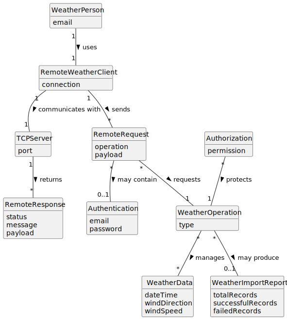

# US044 - Weather Person Remote Access

## 2. Analysis

### 2.1. Relevant Domain Concepts

The relevant domain concepts for this user story are:

* **Weather Person:** user who remotely accesses the system to perform weather-related operations.
* **Remote Weather Client:** TCP-based client application used by the Weather Person.
* **TCP Server:** server component embedded in the system that receives requests from the remote client.
* **Remote Request:** message sent from the client to the system through TCP.
* **Remote Response:** message sent from the system to the client through TCP.
* **Authentication:** validation of the Weather Person's identity.
* **Authorization:** validation of the Weather Person's permissions.
* **Weather Operation:** operation requested remotely, such as registering, importing or consulting weather data.
* **Weather Data:** domain data managed by the weather service.
* **Weather Import Report:** result of a bulk weather data import.

---

### 2.2. Business Rules

* Weather Person remote access must be performed through a TCP client application.
* The TCP client must communicate with the server application embedded in the system.
* The TCP client must not directly access the database.
* The Weather Person must authenticate before executing remote operations.
* The system must enforce authorization for every remote operation.
* The remote client must expose all Weather Person user stories.
* Remote registration of weather data must follow the same rules as US041.
* Remote bulk import of weather data must follow the same rules as US042.
* Remote consultation of weather data must follow the same rules as US043.
* Invalid or malformed TCP requests must be rejected with an appropriate response.
* The TCP connection must be managed safely.

---

### 2.3. Preconditions

* The TCP server must be running.
* The Weather Person must have valid credentials.
* The Weather Person must have permission to execute weather operations.
* The requested weather operation must be supported by the server.
* For operations requiring air control areas, the referenced area must exist.

---

### 2.4. Postconditions

**Successful remote operation:**

* The requested weather operation is executed.
* The system returns a success response to the TCP client.
* The TCP client displays the result to the Weather Person.

**Failed authentication or authorization:**

* No weather operation is executed.
* The system returns an access denied response.
* The TCP client displays an error message.

**Malformed request:**

* No weather operation is executed.
* The system returns an invalid request response.
* The TCP connection remains stable if recovery is possible.

---

### 2.5. Domain Model

