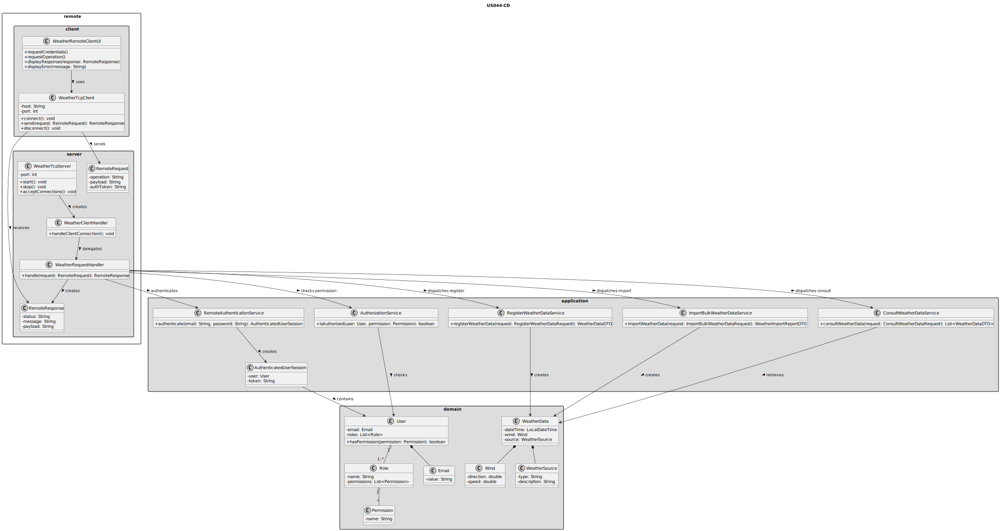
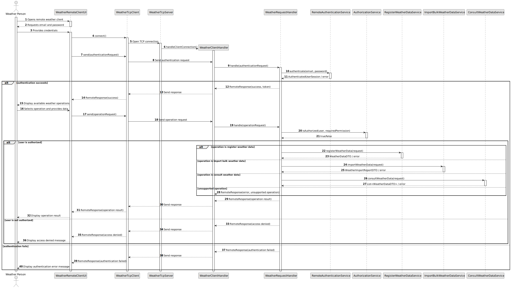

# US044 - Weather Person Remote Access

## 3. Design

### 3.1. Responsibility Assignment

The Weather Person remote access process is divided between the following components:

* **WeatherRemoteClientUI:** interacts with the Weather Person in the TCP client application.
* **WeatherTcpClient:** manages the TCP connection from the client side.
* **WeatherTcpServer:** accepts TCP connections and receives remote requests.
* **WeatherRequestHandler:** interprets requests and dispatches them to the correct application service.
* **RemoteAuthenticationService:** authenticates remote users.
* **AuthorizationService:** checks if the authenticated user has permission to execute the requested operation.
* **RegisterWeatherDataService:** handles remote weather data registration.
* **ImportBulkWeatherDataService:** handles remote bulk weather data import.
* **ConsultWeatherDataService:** handles remote weather data consultation.
* **RemoteRequest:** represents a request sent through TCP.
* **RemoteResponse:** represents a response returned through TCP.

---

### 3.2. Class Diagram

---

### 3.3. Sequence Diagram

---

### 3.4. Applied Patterns

* **Client-Server:** TCP client communicates with a server embedded in the system.
* **Request Handler:** interprets remote requests and routes them to the correct service.
* **Command/Dispatcher:** operation type determines which application service is executed.
* **Service:** each weather operation remains implemented in its own application service.
* **DTO:** request and response objects avoid passing raw strings through the system.
* **Authorization Guard:** every remote operation is protected by authorization checks.
* **Adapter:** the TCP layer adapts remote requests into existing application service calls.

---

### 3.5. Design Remarks

* The TCP client must not access repositories or databases.
* The TCP server should be the only remote entry point for the Weather Person client.
* Existing weather services from US041, US042 and US043 should be reused.
* Authentication should occur before presenting or executing weather operations.
* Authorization should be checked for each operation, not only once at login.
* Malformed requests should not crash the server.
* The protocol should be simple, documented and extensible.