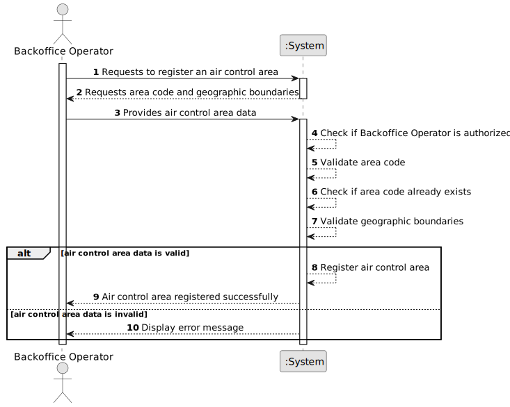

# US050 - Register an Air Control Area

## 1. Requirements Engineering

### 1.1. User Story Description

As a Backoffice Operator, I want to register an air control area.

This functionality allows a Backoffice Operator to create a new air control area in the system. Each air control area must have a unique code and valid geographic boundaries. The same registration must also be possible through a bootstrap process.

---

### 1.2. Customer Specifications and Clarifications

**From the specifications document:**

* Base system information, such as airports and flight control areas, is fed into the system by Backoffice Operators.
* Air control areas are relevant for weather data, airports, flight control and simulation.
* An air control area must have a unique area code.
* Geographic boundaries must be valid.
* Registering an air control area must also be achievable by a bootstrap process.
* Authentication and authorization must be enforced for all users and functionalities.

**From the client clarifications:**

No additional client clarifications are currently available.

---

### 1.3. Acceptance Criteria

* **AC1:** The Backoffice Operator must be able to register a new air control area.
* **AC2:** The air control area code must be unique in the system.
* **AC3:** The air control area code must be provided.
* **AC4:** The air control area must have valid geographic boundaries.
* **AC5:** The system must not register an air control area with an already existing code.
* **AC6:** The system must not register an air control area with invalid geographic boundaries.
* **AC7:** The system must store a successfully registered air control area.
* **AC8:** The system must display a success message when the registration succeeds.
* **AC9:** The system must display an error message when the registration fails.
* **AC10:** Only an authenticated and authorized Backoffice Operator can register an air control area.
* **AC11:** The system must support registering air control areas through a bootstrap process.
* **AC12:** The bootstrap process must follow the same validation rules as manual registration.

---

### 1.4. Found out Dependencies

* This user story depends on US030, because only authenticated and authorized users should be able to access this functionality.
* This user story is related to US052, because airports must be associated with exactly one air control area.
* This user story is related to US041, US042 and US043, because weather data is associated with air control areas.
* This user story is related to US100 and later simulation user stories, because simulations occur within air control areas.
* This user story may depend on a geographic boundary representation being defined.

---

### 1.5. Input and Output Data

**Input Data:**

* Typed data:
    * Air control area code
    * Name or description
    * Geographic boundaries

**Possible geographic boundary data:**

* List of coordinates
* Polygon points
* Minimum and maximum latitude/longitude
* Other future representation accepted by the domain model

**Output Data:**

* In case of success:
    * Success message
    * Registered air control area information

* In case of failure:
    * Error message explaining why the air control area could not be registered

---

### 1.6. System Sequence Diagram

**_Other alternatives might exist._**

---

### 1.7. Other Relevant Remarks

* The exact representation of geographic boundaries may be refined later.
* The initial implementation may use a simplified polygon or bounding box representation.
* The domain model should protect the invariant that an air control area has valid boundaries.
* The air control area code should be treated as a stable identifier.
* Bootstrap registration and manual registration should reuse the same validation rules.