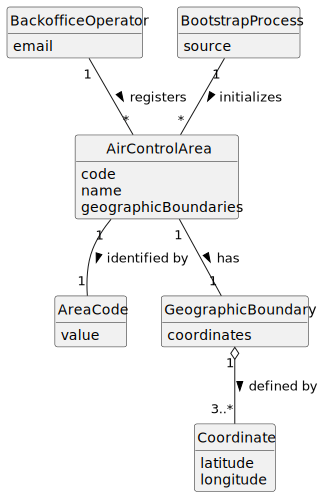

# US050 - Register an Air Control Area

## 2. Analysis

### 2.1. Relevant Domain Concepts

The relevant domain concepts for this user story are:

* **Backoffice Operator:** user responsible for registering base system information.
* **Air Control Area:** geographic area controlled by a flight control entity or used by the system for weather, airports and simulation.
* **Area Code:** unique identifier of the air control area.
* **Geographic Boundaries:** spatial definition of the air control area.
* **Coordinate:** geographic point used to define boundaries.
* **Bootstrap Process:** initialization mechanism that can register default air control areas automatically.

---

### 2.2. Business Rules

* Only an authorized Backoffice Operator can register an air control area.
* An air control area must have a unique code.
* An air control area must have valid geographic boundaries.
* An air control area cannot be registered if its code already exists.
* An air control area cannot be registered if required data is missing.
* Bootstrap registration must follow the same validation rules as manual registration.
* The system must store successfully registered air control areas.
* The air control area should later be usable by airports, weather data and simulations.

---

### 2.3. Preconditions

* The Backoffice Operator must be authenticated.
* The Backoffice Operator must be authorized to register air control areas.
* Required air control area data must be available.
* The geographic boundary representation must be accepted by the system.

---

### 2.4. Postconditions

**Successful registration:**

* A new air control area is created.
* The air control area is stored in the system.
* The air control area can later be associated with airports and weather data.
* The air control area can later be used for simulations.

**Failed registration:**

* No air control area is created.
* The system state remains unchanged.
* An error message is displayed.

---

### 2.5. Domain Model

