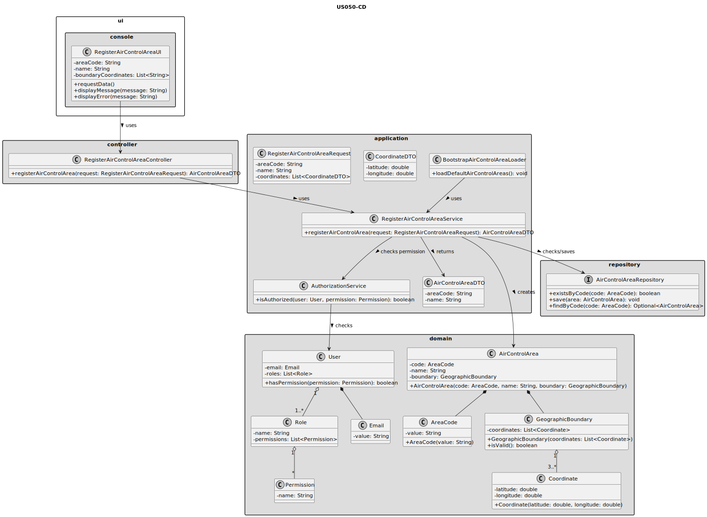
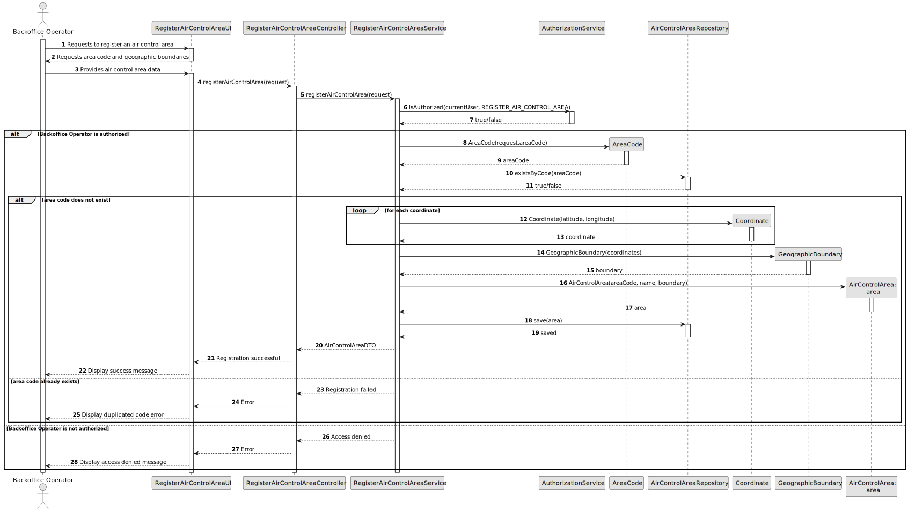

# US050 - Register an Air Control Area

## 3. Design

### 3.1. Responsibility Assignment

The air control area registration process is divided between the following components:

* **RegisterAirControlAreaUI:** interacts with the Backoffice Operator and collects the air control area data.
* **RegisterAirControlAreaController:** receives the registration request from the UI.
* **RegisterAirControlAreaService:** coordinates authorization, validation and persistence.
* **AuthorizationService:** verifies if the current user has permission to register air control areas.
* **AirControlAreaRepository:** checks if the area code already exists and stores the new air control area.
* **AirControlArea:** domain entity representing the controlled geographic area.
* **AreaCode:** value object representing the unique code.
* **GeographicBoundary:** domain object responsible for validating boundary data.
* **Coordinate:** value object representing latitude and longitude.
* **BootstrapAirControlAreaLoader:** supports initial creation of air control areas during bootstrap.

---

### 3.2. Class Diagram

---

### 3.3. Sequence Diagram

---

### 3.4. Applied Patterns

* **UI:** responsible for collecting input from the Backoffice Operator.
* **Controller:** receives and delegates the registration request.
* **Service:** coordinates the use case.
* **Repository:** abstracts persistence and uniqueness checks.
* **Entity:** represents air control areas.
* **Value Object:** represents area codes and coordinates.
* **Bootstrap Loader:** supports automatic initialization of default air control areas.

---

### 3.5. Design Remarks

* The UI must not access repositories directly.
* The Controller should not contain business rules.
* The Service should coordinate authorization and persistence.
* The `AirControlArea` or `GeographicBoundary` domain object should protect boundary validity.
* The area code uniqueness check should be handled through the repository.
* Bootstrap registration should reuse the same service or domain validation rules as manual registration.