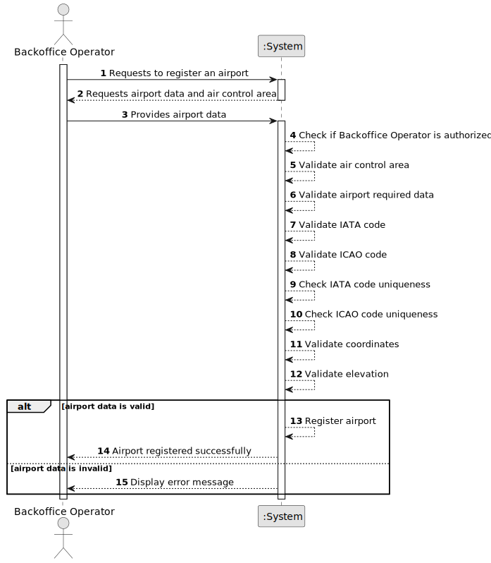

# US052 - Create an Airport

## 1. Requirements Engineering

### 1.1. User Story Description

As a Backoffice Operator, I want to register an airport in a given air control area.

This functionality allows a Backoffice Operator to create an airport and associate it with exactly one existing air control area. The airport must have unique IATA and ICAO codes, valid coordinates and an elevation in meters above sea level. This registration must also be possible through a bootstrap process.

---

### 1.2. Customer Specifications and Clarifications

**From the specifications document:**

* Base system information, such as airports and flight control areas, is fed into the system by Backoffice Operators.
* An airport must be associated with exactly one air control area.
* An airport has an ICAO code and an IATA code.
* ICAO and IATA airport codes must be unique worldwide.
* An airport has location coordinates.
* Airport coordinates must be valid.
* An airport has an elevation in meters above sea level.
* Airport registration must also be achieved by a bootstrap process.
* Authentication and authorization must be enforced for all users and functionalities.

**From the client clarifications:**

No additional client clarifications are currently available.

---

### 1.3. Acceptance Criteria

* **AC1:** The Backoffice Operator must be able to register a new airport.
* **AC2:** The airport must be associated with exactly one existing air control area.
* **AC3:** The airport must have a name.
* **AC4:** The airport must have a town.
* **AC5:** The airport must have a country.
* **AC6:** The airport must have a valid IATA code.
* **AC7:** The airport must have a valid ICAO code.
* **AC8:** The IATA code must be unique worldwide.
* **AC9:** The ICAO code must be unique worldwide.
* **AC10:** The airport must have valid coordinates.
* **AC11:** The airport must have an elevation in meters above sea level.
* **AC12:** The system must not register an airport associated with a non-existing air control area.
* **AC13:** The system must not register an airport with duplicated IATA or ICAO codes.
* **AC14:** Only an authenticated and authorized Backoffice Operator can register airports.
* **AC15:** The system must support registering airports through a bootstrap process.
* **AC16:** Bootstrap registration must follow the same validation rules as manual registration.

---

### 1.4. Found out Dependencies

* This user story depends on US030, because only authenticated and authorized users should be able to access this functionality.
* This user story depends on US050, because an airport must be associated with an existing air control area.
* This user story is related to US073, because flight routes are created between airports.
* This user story is related to US080, because flight plans depend on routes and therefore indirectly on airports.
* This user story is related to simulation user stories, because simulations may use airport location and altitude information.
* This user story may depend on country representation decisions, since the specification notes that country names may change.

---

### 1.5. Input and Output Data

**Input Data:**

* Selected data:
    * Air control area

* Typed data:
    * Airport name
    * Town
    * Country
    * IATA code
    * ICAO code
    * Latitude
    * Longitude
    * Elevation in meters

**Output Data:**

* In case of success:
    * Success message
    * Registered airport information

* In case of failure:
    * Error message explaining why the airport could not be registered

---

### 1.6. System Sequence Diagram

**_Other alternatives might exist._**

---

### 1.7. Other Relevant Remarks

* The airport must belong to one and only one air control area.
* IATA and ICAO codes should be treated as stable identifiers.
* The exact country representation may be refined later.
* Bootstrap registration and manual registration should reuse the same validation rules.
* Airport coordinates should be validated independently from the UI.