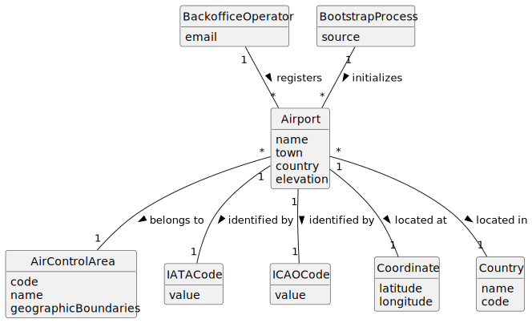

# US052 - Create an Airport

## 2. Analysis

### 2.1. Relevant Domain Concepts

The relevant domain concepts for this user story are:

* **Backoffice Operator:** user responsible for registering base system information.
* **Airport:** physical airport registered in the system.
* **Air Control Area:** area to which the airport belongs.
* **IATA Code:** airport code that must be unique worldwide.
* **ICAO Code:** airport code that must be unique worldwide.
* **Coordinates:** geographic location of the airport.
* **Elevation:** airport altitude in meters above sea level.
* **Country:** country where the airport is located.
* **Bootstrap Process:** initialization mechanism that can register default airports automatically.

---

### 2.2. Business Rules

* Only an authorized Backoffice Operator can register airports.
* An airport must belong to exactly one existing air control area.
* An airport must have a name, town and country.
* An airport must have a valid IATA code.
* An airport must have a valid ICAO code.
* IATA codes must be unique worldwide.
* ICAO codes must be unique worldwide.
* Airport coordinates must be valid.
* Airport elevation must be registered in meters above sea level.
* An airport cannot be registered if required data is missing.
* An airport cannot be registered if its IATA or ICAO code is already used.
* Bootstrap registration must follow the same validation rules as manual registration.

---

### 2.3. Preconditions

* The Backoffice Operator must be authenticated.
* The Backoffice Operator must be authorized to register airports.
* The target air control area must exist.
* Required airport data must be available.

---

### 2.4. Postconditions

**Successful registration:**

* A new airport is created.
* The airport is associated with exactly one air control area.
* The airport is stored in the system.
* The airport can later be used for routes, flight plans and simulations.

**Failed registration:**

* No airport is created.
* The system state remains unchanged.
* An error message is displayed.

---

### 2.5. Domain Model

