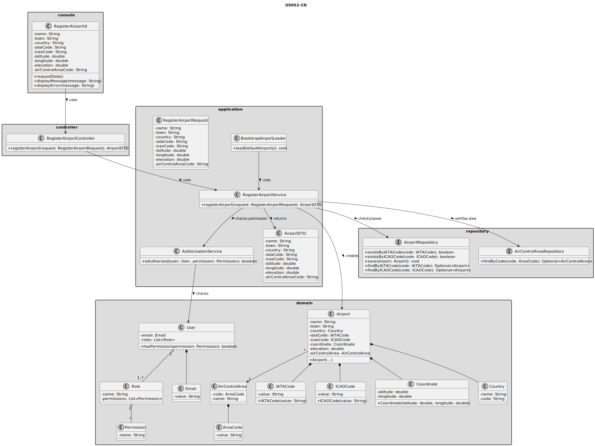
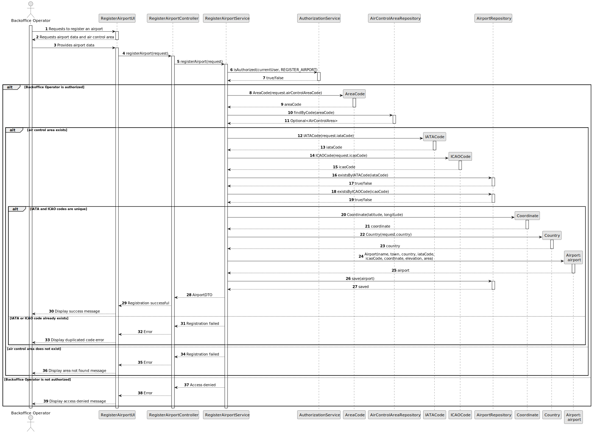

# US052 - Create an Airport

## 3. Design

### 3.1. Responsibility Assignment

The airport registration process is divided between the following components:

* **RegisterAirportUI:** interacts with the Backoffice Operator and collects airport data.
* **RegisterAirportController:** receives the registration request from the UI.
* **RegisterAirportService:** coordinates authorization, validation and persistence.
* **AuthorizationService:** verifies if the current user has permission to register airports.
* **AirControlAreaRepository:** verifies if the selected air control area exists.
* **AirportRepository:** checks IATA/ICAO uniqueness and stores the new airport.
* **Airport:** domain entity representing an airport.
* **IATACode:** value object representing the airport IATA code.
* **ICAOCode:** value object representing the airport ICAO code.
* **Coordinate:** value object representing latitude and longitude.
* **Country:** domain object/value object representing the country.
* **BootstrapAirportLoader:** supports initial creation of airports during bootstrap.

---

### 3.2. Class Diagram

---

### 3.3. Sequence Diagram

---

### 3.4. Applied Patterns

* **UI:** responsible for collecting input from the Backoffice Operator.
* **Controller:** receives and delegates the request.
* **Service:** coordinates the use case.
* **Repository:** abstracts persistence and uniqueness checks.
* **Entity:** represents airports.
* **Value Object:** represents IATA code, ICAO code and coordinates.
* **Bootstrap Loader:** supports automatic initialization of default airports.

---

### 3.5. Design Remarks

* The UI must not access repositories directly.
* The Controller should not contain business rules.
* The Service should coordinate authorization and persistence.
* IATA and ICAO validation should be handled by their own value objects.
* Coordinate validation should be handled by the `Coordinate` value object.
* The airport should not be created without an existing air control area.
* Bootstrap registration should reuse the same validation rules as manual registration.