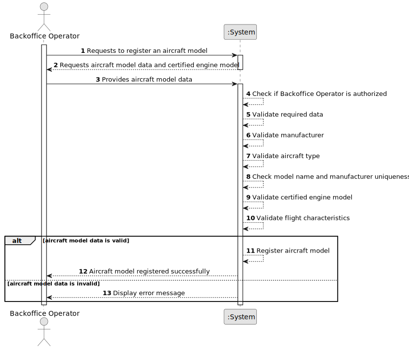

# US055 - Create an Aircraft Model

## 1. Requirements Engineering

### 1.1. User Story Description

As a Backoffice Operator, I want to register a new aircraft model.

This functionality allows a Backoffice Operator to register an aircraft model in the system. The aircraft model must have a model name, a manufacturer, a type and relevant flight characteristics. The combination of model name and manufacturer must be unique. Each aircraft model must also have at least one certified engine model associated with it. The same registration must be possible through a bootstrap process.

---

### 1.2. Customer Specifications and Clarifications

**From the specifications document:**

* Aircraft models are part of the base system information managed by Backoffice Operators.
* An aircraft model is a motorized commercial aircraft.
* There are many types of motorizations, such as turboprop, turbofan, turbojet, ram jet and electric propeller.
* An aircraft model has a model ID.
* An aircraft model has a maker/manufacturer.
* An aircraft model has a type, such as passenger, cargo or mixed.
* An aircraft model has an empty weight.
* An aircraft model has a maximum take-off weight, MTOW.
* An aircraft model has a maximum zero fuel weight, MZFW.
* An aircraft model has a maximum fuel capacity.
* An aircraft model has a service ceiling.
* An aircraft model has a cruise speed.
* An aircraft model has a wing area.
* An aircraft model has a drag coefficient, Cd.
* An aircraft model has a lift coefficient, Cl.
* Any aircraft model must have at least one certified engine model.
* The combination of model name and manufacturer must be unique.
* Registering an aircraft model must also be achievable by a bootstrap process.
* Authentication and authorization must be enforced for all users and functionalities.

**From the client clarifications:**

No additional client clarifications are currently available.

---

### 1.3. Acceptance Criteria

* **AC1:** The Backoffice Operator must be able to register a new aircraft model.
* **AC2:** The aircraft model must have a model name.
* **AC3:** The aircraft model must have a manufacturer.
* **AC4:** The combination of model name and manufacturer must be unique.
* **AC5:** The aircraft model must have an aircraft type.
* **AC6:** The aircraft model must have at least one certified engine model.
* **AC7:** The selected certified engine model must exist in the system.
* **AC8:** The aircraft model must have valid empty weight.
* **AC9:** The aircraft model must have valid maximum take-off weight.
* **AC10:** The aircraft model must have valid maximum zero fuel weight.
* **AC11:** The aircraft model must have valid maximum fuel capacity.
* **AC12:** The aircraft model must have valid service ceiling.
* **AC13:** The aircraft model must have valid cruise speed.
* **AC14:** The aircraft model must have valid wing area.
* **AC15:** The aircraft model must have valid drag coefficient.
* **AC16:** The aircraft model must have valid lift coefficient.
* **AC17:** The system must not register an aircraft model with missing required data.
* **AC18:** The system must not register an aircraft model with duplicated model name and manufacturer combination.
* **AC19:** Only an authenticated and authorized Backoffice Operator can register aircraft models.
* **AC20:** The system must support registering aircraft models through a bootstrap process.
* **AC21:** Bootstrap registration must follow the same validation rules as manual registration.

---

### 1.4. Found out Dependencies

* This user story depends on US030, because only authenticated and authorized users should be able to access this functionality.
* This user story depends on US056, because an aircraft model must be associated with at least one certified engine model.
* This user story may depend on the existence of aircraft manufacturers in the system.
* This user story is related to US057, because additional engine models can later be added to an aircraft model's certified engine list.
* This user story is related to US058, because engine models can later be removed from an aircraft model's certified engine list if allowed.
* This user story is related to US070, because aircraft added to an air transport company's fleet must be of a specific aircraft model.
* This user story is related to US075, because pilots may be certified to pilot one or more aircraft models.

---

### 1.5. Input and Output Data

**Input Data:**

* Selected data:
    * Manufacturer
    * Aircraft type
    * At least one certified engine model

* Typed data:
    * Model name
    * Empty weight
    * Maximum take-off weight
    * Maximum zero fuel weight
    * Maximum fuel capacity
    * Service ceiling
    * Cruise speed
    * Wing area
    * Drag coefficient
    * Lift coefficient

**Output Data:**

* In case of success:
    * Success message
    * Registered aircraft model information

* In case of failure:
    * Error message explaining why the aircraft model could not be registered

---

### 1.6. System Sequence Diagram

**_Other alternatives might exist._**

---

### 1.7. Other Relevant Remarks

* US056 was documented before this user story because aircraft engine models are required to create valid aircraft models.
* An aircraft model cannot exist without at least one certified engine model.
* The exact representation of aircraft type and flight characteristics may be refined later.
* The first implementation may use simplified technical attributes if necessary.
* Bootstrap registration and manual registration should reuse the same validation rules.