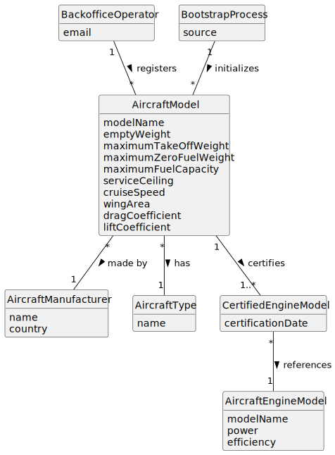

# US055 - Create an Aircraft Model

## 2. Analysis

### 2.1. Relevant Domain Concepts

The relevant domain concepts for this user story are:

* **Backoffice Operator:** user responsible for registering base system information.
* **Aircraft Model:** commercial aircraft model used to create actual aircraft.
* **Aircraft Manufacturer:** organization responsible for producing the aircraft model.
* **Aircraft Type:** classification of the aircraft model, such as passenger, cargo or mixed.
* **Aircraft Engine Model:** engine model that may be certified for use in an aircraft model.
* **Certified Engine Model:** engine model associated with an aircraft model as compatible/certified.
* **Flight Characteristics:** technical values such as weights, fuel capacity, service ceiling, cruise speed, wing area, drag coefficient and lift coefficient.
* **Bootstrap Process:** initialization mechanism that can register default aircraft models automatically.

---

### 2.2. Business Rules

* Only an authorized Backoffice Operator can register aircraft models.
* An aircraft model must have a model name.
* An aircraft model must have a manufacturer.
* The combination of model name and manufacturer must be unique.
* An aircraft model must have an aircraft type.
* An aircraft model must have at least one certified engine model.
* A certified engine model must already exist in the system.
* Aircraft model technical characteristics must be valid.
* Empty weight must be positive.
* Maximum take-off weight must be positive.
* Maximum zero fuel weight must be positive.
* Maximum fuel capacity must be positive.
* Service ceiling must be positive.
* Cruise speed must be positive.
* Wing area must be positive.
* Drag coefficient must be valid.
* Lift coefficient must be valid.
* Bootstrap registration must follow the same validation rules as manual registration.

---

### 2.3. Preconditions

* The Backoffice Operator must be authenticated.
* The Backoffice Operator must be authorized to register aircraft models.
* Required aircraft model data must be available.
* The manufacturer must be known or accepted by the system.
* At least one aircraft engine model must already exist.

---

### 2.4. Postconditions

**Successful registration:**

* A new aircraft model is created.
* The aircraft model is stored in the system.
* The aircraft model has at least one certified engine model.
* The aircraft model can later be used to register actual aircraft.
* The aircraft model can later be used for pilot certification, flight planning and simulation.

**Failed registration:**

* No aircraft model is created.
* The system state remains unchanged.
* An error message is displayed.

---

### 2.5. Domain Model

