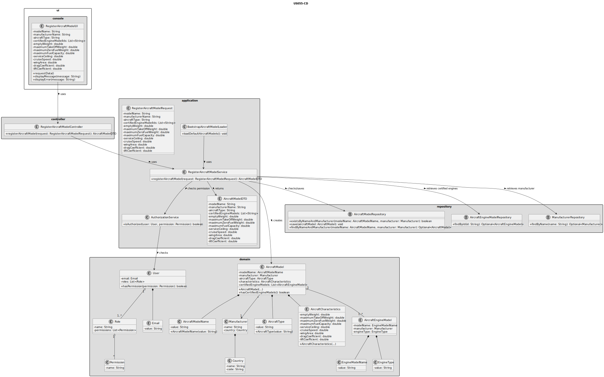
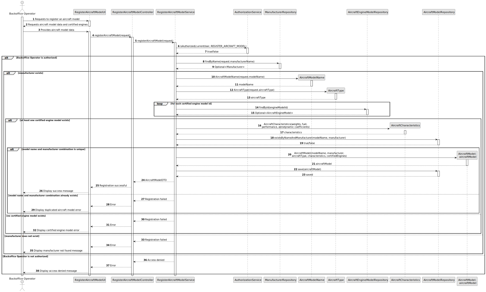

# US055 - Create an Aircraft Model

## 3. Design

### 3.1. Responsibility Assignment

The aircraft model registration process is divided between the following components:

* **RegisterAircraftModelUI:** interacts with the Backoffice Operator and collects aircraft model data.
* **RegisterAircraftModelController:** receives the registration request from the UI.
* **RegisterAircraftModelService:** coordinates authorization, validation and persistence.
* **AuthorizationService:** verifies if the current user has permission to register aircraft models.
* **AircraftModelRepository:** checks model name and manufacturer uniqueness and stores the new aircraft model.
* **AircraftEngineModelRepository:** verifies that the selected certified engine models exist.
* **ManufacturerRepository:** verifies or retrieves the selected manufacturer.
* **AircraftModel:** domain entity representing the aircraft model.
* **AircraftModelName:** value object representing the model name.
* **AircraftCharacteristics:** domain object grouping flight characteristics.
* **CertifiedEngineModel:** association between an aircraft model and an engine model.
* **BootstrapAircraftModelLoader:** supports initial creation of aircraft models during bootstrap.

---

### 3.2. Class Diagram

---

### 3.3. Sequence Diagram

---

### 3.4. Applied Patterns

* **UI:** responsible for collecting input from the Backoffice Operator.
* **Controller:** receives and delegates the request.
* **Service:** coordinates the use case.
* **Repository:** abstracts persistence and uniqueness checks.
* **Entity:** represents aircraft models.
* **Value Object:** represents model name and aircraft technical characteristics.
* **Aggregate Root:** `AircraftModel` protects the invariant that it has at least one certified engine model.
* **Bootstrap Loader:** supports automatic initialization of default aircraft models.

---

### 3.5. Design Remarks

* The UI must not access repositories directly.
* The Controller should not contain business rules.
* The Service should coordinate authorization, lookup and persistence.
* The domain should protect the invariant that an aircraft model has at least one certified engine model.
* The repository should verify uniqueness of model name and manufacturer combination.
* The selected certified engine models must already exist.
* Bootstrap registration should reuse the same validation rules as manual registration.
* US056 should be implemented before this user story because aircraft models require existing aircraft engine models.