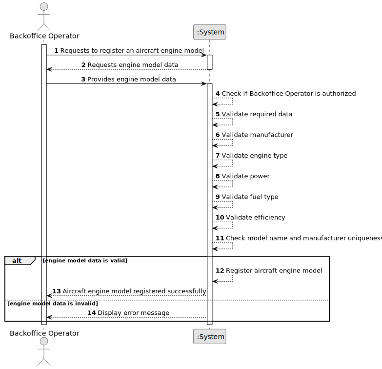

# US056 - Create an Aircraft Engine Model

## 1. Requirements Engineering

### 1.1. User Story Description

As a Backoffice Operator, I want to register a new engine model to be used by aircrafts.

This functionality allows a Backoffice Operator to register an aircraft engine model in the system. Each engine model must be uniquely identified by the combination of its model name and manufacturer. The engine model should also include relevant technical information such as engine type, power, fuel type and efficiency. The same registration must also be possible through a bootstrap process.

---

### 1.2. Customer Specifications and Clarifications

**From the specifications document:**

* Aircraft and engine manufacturers must be stored in the system.
* Aircraft engine models must be registered by Backoffice Operators.
* The engine model's name and manufacturer combination must be unique.
* Important information regarding the engine type, power, fuel and efficiency should be included.
* There are many types of motorizations, such as turboprop, turbofan, turbojet, ram jet and electric propeller.
* Registering an aircraft engine model must also be achievable by a bootstrap process.
* Authentication and authorization must be enforced for all users and functionalities.

**From the client clarifications:**

No additional client clarifications are currently available.

---

### 1.3. Acceptance Criteria

* **AC1:** The Backoffice Operator must be able to register a new aircraft engine model.
* **AC2:** The engine model must have a model name.
* **AC3:** The engine model must have a manufacturer.
* **AC4:** The combination of model name and manufacturer must be unique.
* **AC5:** The engine model must have an engine type.
* **AC6:** The engine model should include power information.
* **AC7:** The engine model should include fuel type information.
* **AC8:** The engine model should include efficiency information.
* **AC9:** The system must not register an engine model with a duplicated model name and manufacturer combination.
* **AC10:** The system must not register an engine model with missing required data.
* **AC11:** Only an authenticated and authorized Backoffice Operator can register aircraft engine models.
* **AC12:** The system must support registering aircraft engine models through a bootstrap process.
* **AC13:** Bootstrap registration must follow the same validation rules as manual registration.

---

### 1.4. Found out Dependencies

* This user story depends on US030, because only authenticated and authorized users should be able to access this functionality.
* This user story may depend on the existence of engine manufacturers in the system.
* This user story is a dependency of US055, because an aircraft model must have at least one certified engine model.
* This user story is related to US057, because registered engine models can later be added to aircraft models.
* This user story is related to US058, because engine models may later be removed from an aircraft model's certified engine list if business rules allow it.

---

### 1.5. Input and Output Data

**Input Data:**

* Selected data:
    * Manufacturer
    * Engine type
    * Fuel type

* Typed data:
    * Model name
    * Power
    * Efficiency

**Output Data:**

* In case of success:
    * Success message
    * Registered aircraft engine model information

* In case of failure:
    * Error message explaining why the aircraft engine model could not be registered

---

### 1.6. System Sequence Diagram

**_Other alternatives might exist._**

---

### 1.7. Other Relevant Remarks

* Although US056 appears after US055 in the specification, it is documented and implemented first because US055 depends on the existence of at least one aircraft engine model.
* The exact representation of power and efficiency may be refined later.
* The first implementation may use simplified technical attributes.
* The design should allow future extension for different engine technologies.
* Bootstrap registration and manual registration should reuse the same validation rules.