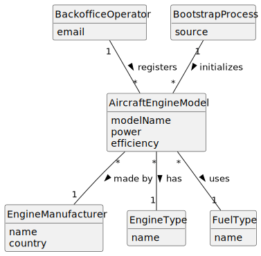

# US056 - Create an Aircraft Engine Model

## 2. Analysis

### 2.1. Relevant Domain Concepts

The relevant domain concepts for this user story are:

* **Backoffice Operator:** user responsible for registering base system information.
* **Aircraft Engine Model:** engine model that can later be certified for use in aircraft models.
* **Engine Manufacturer:** organization responsible for producing the engine model.
* **Engine Type:** type of motorization, such as turboprop, turbofan, turbojet, ram jet or electric propeller.
* **Fuel Type:** type of fuel or energy source used by the engine.
* **Power:** technical power information associated with the engine model.
* **Efficiency:** technical efficiency information associated with the engine model.
* **Bootstrap Process:** initialization mechanism that can register default aircraft engine models automatically.

---

### 2.2. Business Rules

* Only an authorized Backoffice Operator can register aircraft engine models.
* An aircraft engine model must have a model name.
* An aircraft engine model must have a manufacturer.
* The combination of model name and manufacturer must be unique.
* An aircraft engine model must have an engine type.
* Power, fuel type and efficiency should be stored when available.
* An aircraft engine model cannot be registered if required data is missing.
* An aircraft engine model cannot be registered if another model with the same name and manufacturer already exists.
* Bootstrap registration must follow the same validation rules as manual registration.
* Registered aircraft engine models may later be associated with aircraft models as certified engines.

---

### 2.3. Preconditions

* The Backoffice Operator must be authenticated.
* The Backoffice Operator must be authorized to register aircraft engine models.
* Required engine model data must be available.
* The manufacturer must be known or accepted by the system.

---

### 2.4. Postconditions

**Successful registration:**

* A new aircraft engine model is created.
* The aircraft engine model is stored in the system.
* The aircraft engine model can later be associated with aircraft models.
* The aircraft engine model can later be used when creating aircraft model variants.

**Failed registration:**

* No aircraft engine model is created.
* The system state remains unchanged.
* An error message is displayed.

---

### 2.5. Domain Model

