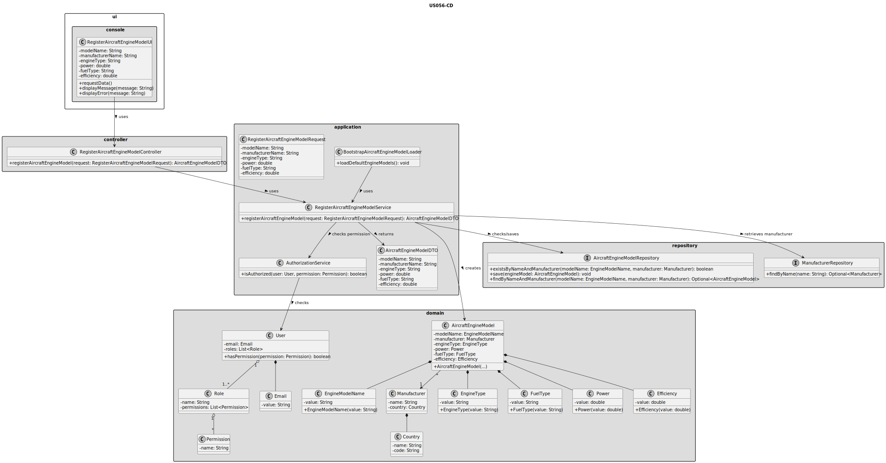
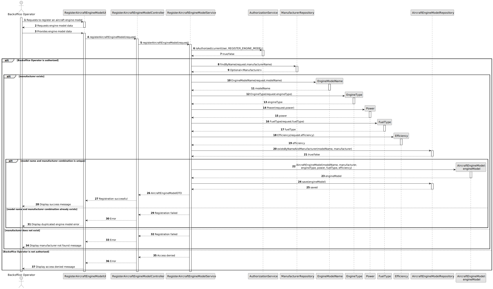

# US056 - Create an Aircraft Engine Model

## 3. Design

### 3.1. Responsibility Assignment

The aircraft engine model registration process is divided between the following components:

* **RegisterAircraftEngineModelUI:** interacts with the Backoffice Operator and collects engine model data.
* **RegisterAircraftEngineModelController:** receives the registration request from the UI.
* **RegisterAircraftEngineModelService:** coordinates authorization, validation and persistence.
* **AuthorizationService:** verifies if the current user has permission to register aircraft engine models.
* **AircraftEngineModelRepository:** checks model name and manufacturer uniqueness and stores the new engine model.
* **ManufacturerRepository:** verifies or retrieves the selected manufacturer.
* **AircraftEngineModel:** domain entity representing the engine model.
* **EngineModelName:** value object representing the model name.
* **EngineType:** value object/entity representing the engine type.
* **FuelType:** value object/entity representing the fuel type.
* **Power:** value object representing engine power.
* **Efficiency:** value object representing engine efficiency.
* **BootstrapAircraftEngineModelLoader:** supports initial creation of aircraft engine models during bootstrap.

---

### 3.2. Class Diagram

---

### 3.3. Sequence Diagram

---

### 3.4. Applied Patterns

* **UI:** responsible for collecting input from the Backoffice Operator.
* **Controller:** receives and delegates the request.
* **Service:** coordinates the use case.
* **Repository:** abstracts persistence and uniqueness checks.
* **Entity:** represents aircraft engine models.
* **Value Object:** represents model name, power and efficiency.
* **Bootstrap Loader:** supports automatic initialization of default engine models.

---

### 3.5. Design Remarks

* The UI must not access repositories directly.
* The Controller should not contain business rules.
* The Service should coordinate authorization and persistence.
* The domain should protect required invariants, especially model name and manufacturer existence.
* The repository should enforce or verify the uniqueness of the model name and manufacturer combination.
* Bootstrap registration should reuse the same validation rules as manual registration.
* This user story should be implemented before US055 because aircraft models require at least one certified engine model.