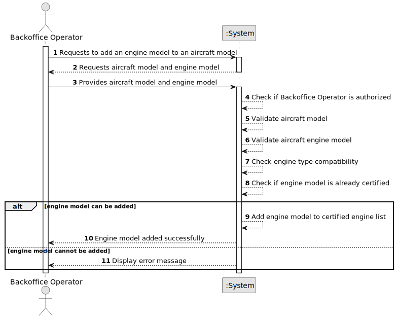

# US057 - Add an Engine Model to an Aircraft Model

## 1. Requirements Engineering

### 1.1. User Story Description

As a Backoffice Operator, I want to add an engine model to an aircraft model's list of certified engines.

This functionality allows a Backoffice Operator to associate an existing aircraft engine model with an existing aircraft model, making that engine model certified for use in that aircraft model. The system must ensure that the engine type is compatible and that the same engine model is not added twice to the same aircraft model.

---

### 1.2. Customer Specifications and Clarifications

**From the specifications document:**

* Aircraft models must have at least one certified engine model.
* Aircraft engine models can be associated with aircraft models as certified engines.
* Engine type must be compatible.
* The same engine model cannot be added twice to the same aircraft.
* An aircraft model might have several aircraft variants, corresponding to combinations of aircraft model and engine configuration.
* Authentication and authorization must be enforced for all users and functionalities.

**From the client clarifications:**

No additional client clarifications are currently available.

---

### 1.3. Acceptance Criteria

* **AC1:** The Backoffice Operator must be able to add an engine model to an aircraft model's certified engine list.
* **AC2:** The aircraft model must exist in the system.
* **AC3:** The aircraft engine model must exist in the system.
* **AC4:** The engine type must be compatible with the aircraft model.
* **AC5:** The same engine model must not be added twice to the same aircraft model.
* **AC6:** The system must update the aircraft model's certified engine list after a successful operation.
* **AC7:** The system must display a success message when the engine model is added successfully.
* **AC8:** The system must display an error message when the operation fails.
* **AC9:** Only an authenticated and authorized Backoffice Operator can add certified engine models.
* **AC10:** The operation must not create a new aircraft model.
* **AC11:** The operation must not create a new aircraft engine model.

---

### 1.4. Found out Dependencies

* This user story depends on US030, because only authenticated and authorized users should be able to access this functionality.
* This user story depends on US055, because an aircraft model must exist before an engine model can be added to it.
* This user story depends on US056, because an aircraft engine model must exist before it can be certified for an aircraft model.
* This user story is related to US058, because certified engine models may later be removed from an aircraft model.
* This user story is related to US070, because aircraft added to a company's fleet must use valid aircraft model and engine configurations.

---

### 1.5. Input and Output Data

**Input Data:**

* Selected data:
    * Aircraft model
    * Aircraft engine model

**Output Data:**

* In case of success:
    * Success message
    * Updated aircraft model certified engine list

* In case of failure:
    * Error message explaining why the engine model could not be added

---

### 1.6. System Sequence Diagram

**_Other alternatives might exist._**

---

### 1.7. Other Relevant Remarks

* This user story modifies an existing aircraft model.
* The engine model must already exist; this operation does not create engine models.
* The aircraft model must already exist; this operation does not create aircraft models.
* Compatibility rules may initially be simplified and later refined.
* The aircraft model aggregate should protect the invariant that the same certified engine model cannot be added twice.