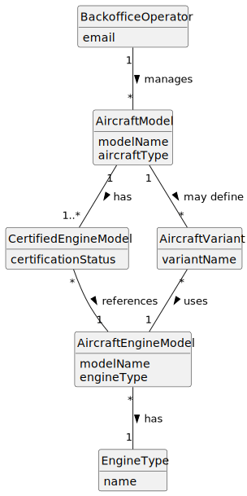

# US057 - Add an Engine Model to an Aircraft Model

## 2. Analysis

### 2.1. Relevant Domain Concepts

The relevant domain concepts for this user story are:

* **Backoffice Operator:** user responsible for managing base system information.
* **Aircraft Model:** commercial aircraft model that may have one or more certified engine models.
* **Aircraft Engine Model:** engine model that may be certified for use in aircraft models.
* **Certified Engine Model:** association between an aircraft model and a compatible aircraft engine model.
* **Engine Type:** type of motorization used to determine compatibility.
* **Aircraft Variant:** possible combination of an aircraft model and an engine configuration.

---

### 2.2. Business Rules

* Only an authorized Backoffice Operator can add an engine model to an aircraft model.
* The aircraft model must already exist.
* The aircraft engine model must already exist.
* The aircraft engine model must be compatible with the aircraft model.
* The same engine model cannot be added twice to the same aircraft model.
* Adding an engine model updates the aircraft model's certified engine list.
* This operation does not create new aircraft models.
* This operation does not create new aircraft engine models.
* The aircraft model aggregate should enforce the certified engine list invariants.

---

### 2.3. Preconditions

* The Backoffice Operator must be authenticated.
* The Backoffice Operator must be authorized to manage aircraft models.
* The aircraft model must exist.
* The aircraft engine model must exist.
* Compatibility rules must be available.

---

### 2.4. Postconditions

**Successful addition:**

* The selected aircraft engine model is added to the aircraft model's certified engine list.
* The aircraft model is stored with the updated certified engine list.
* The aircraft model can later use the newly certified engine model.

**Failed addition:**

* The aircraft model remains unchanged.
* No new certified engine association is created.
* An error message is displayed.

---

### 2.5. Domain Model

