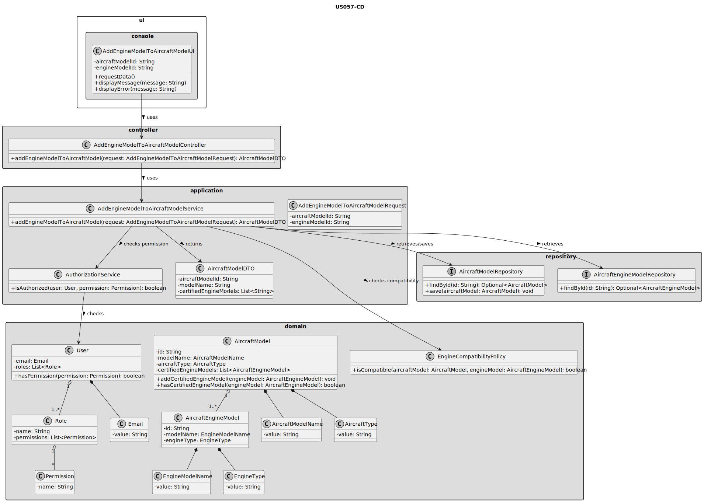
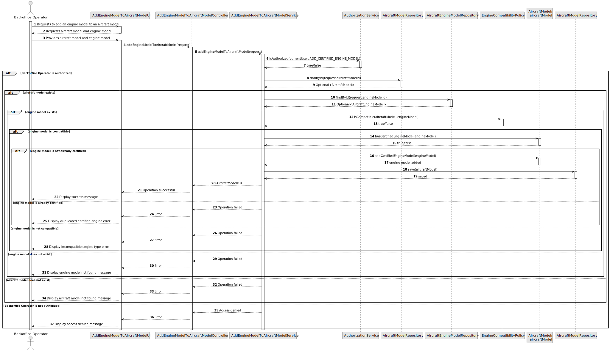

# US057 - Add an Engine Model to an Aircraft Model

## 3. Design

### 3.1. Responsibility Assignment

The process of adding an engine model to an aircraft model is divided between the following components:

* **AddEngineModelToAircraftModelUI:** interacts with the Backoffice Operator and collects the aircraft model and engine model.
* **AddEngineModelToAircraftModelController:** receives the request from the UI.
* **AddEngineModelToAircraftModelService:** coordinates authorization, lookup, compatibility validation and persistence.
* **AuthorizationService:** verifies if the current user has permission to manage aircraft models.
* **AircraftModelRepository:** retrieves and stores the aircraft model.
* **AircraftEngineModelRepository:** retrieves the selected aircraft engine model.
* **AircraftModel:** aggregate root responsible for enforcing the certified engine list invariants.
* **AircraftEngineModel:** domain entity representing the engine model to be added.
* **EngineCompatibilityPolicy:** domain service or policy responsible for checking compatibility.

---

### 3.2. Class Diagram

---

### 3.3. Sequence Diagram

---

### 3.4. Applied Patterns

* **UI:** responsible for collecting input from the Backoffice Operator.
* **Controller:** receives and delegates the request.
* **Service:** coordinates the use case.
* **Repository:** abstracts persistence and lookup operations.
* **Aggregate Root:** `AircraftModel` protects the certified engine list.
* **Domain Policy:** `EngineCompatibilityPolicy` centralizes compatibility rules.
* **Entity:** represents aircraft models and engine models.

---

### 3.5. Design Remarks

* The UI must not access repositories directly.
* The Controller should not contain business rules.
* The Service should coordinate lookup and authorization.
* The AircraftModel aggregate should expose a method such as `addCertifiedEngineModel(engineModel)`.
* Duplicate certification should be prevented inside the AircraftModel aggregate.
* Compatibility rules should be isolated in a policy/domain service so they can evolve later.
* This operation should not create aircraft models or engine models.