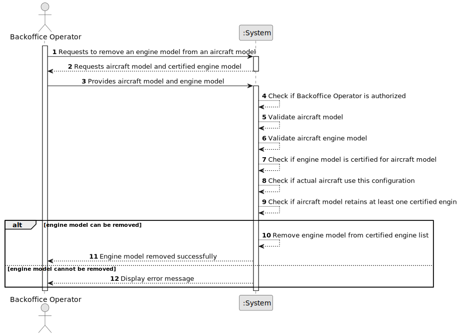

# US058 - Remove an Engine Model from an Aircraft Model

## 1. Requirements Engineering

### 1.1. User Story Description

As a Backoffice Operator, I want to remove an engine model from an aircraft model's list of certified engines.

This functionality allows a Backoffice Operator to remove a certified engine model from an existing aircraft model. The system must ensure that the aircraft model keeps at least one certified engine model and that the engine model is not currently being used by actual aircraft.

---

### 1.2. Customer Specifications and Clarifications

**From the specifications document:**

* Aircraft models must have at least one certified engine model.
* A Backoffice Operator can remove an engine model from an aircraft model's list of certified engines.
* This is not possible if there are actual aircrafts using that model.
* An aircraft model must retain at least one certified engine model.
* Authentication and authorization must be enforced for all users and functionalities.

**From the client clarifications:**

No additional client clarifications are currently available.

---

### 1.3. Acceptance Criteria

* **AC1:** The Backoffice Operator must be able to remove an engine model from an aircraft model's certified engine list.
* **AC2:** The aircraft model must exist in the system.
* **AC3:** The aircraft engine model must exist in the system.
* **AC4:** The aircraft engine model must currently be certified for the selected aircraft model.
* **AC5:** The system must not remove the engine model if it is used by actual aircraft.
* **AC6:** The system must not remove the engine model if it would leave the aircraft model without certified engine models.
* **AC7:** The system must update the aircraft model's certified engine list after a successful removal.
* **AC8:** The system must display a success message when the engine model is removed successfully.
* **AC9:** The system must display an error message when the operation fails.
* **AC10:** Only an authenticated and authorized Backoffice Operator can remove certified engine models.
* **AC11:** The operation must not delete the aircraft engine model from the system.
* **AC12:** The operation must not delete the aircraft model from the system.

---

### 1.4. Found out Dependencies

* This user story depends on US030, because only authenticated and authorized users should be able to access this functionality.
* This user story depends on US055, because an aircraft model must exist.
* This user story depends on US056, because an aircraft engine model must exist.
* This user story depends on US057, because an engine model must already be certified for the aircraft model before it can be removed.
* This user story is related to US070, because actual aircraft may use a specific aircraft model and engine configuration.
* This user story is related to future aircraft variant/configuration rules.

---

### 1.5. Input and Output Data

**Input Data:**

* Selected data:
    * Aircraft model
    * Certified aircraft engine model to remove

**Output Data:**

* In case of success:
    * Success message
    * Updated aircraft model certified engine list

* In case of failure:
    * Error message explaining why the engine model could not be removed

---

### 1.6. System Sequence Diagram

**_Other alternatives might exist._**

---

### 1.7. Other Relevant Remarks

* This operation removes the certification relationship between an aircraft model and an engine model.
* This operation does not delete the aircraft engine model itself.
* This operation does not delete the aircraft model itself.
* The AircraftModel aggregate should protect the invariant that at least one certified engine model remains.
* The system must also check whether actual aircraft are using the engine configuration before allowing removal.