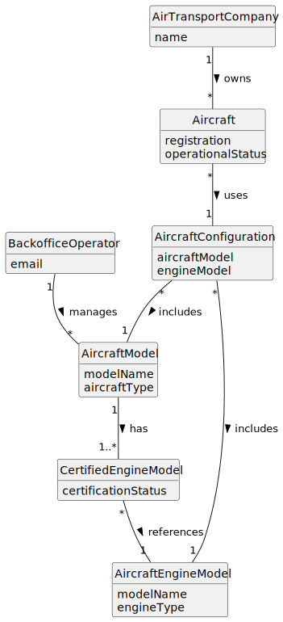

# US058 - Remove an Engine Model from an Aircraft Model

## 2. Analysis

### 2.1. Relevant Domain Concepts

The relevant domain concepts for this user story are:

* **Backoffice Operator:** user responsible for managing base system information.
* **Aircraft Model:** commercial aircraft model that contains a list of certified engine models.
* **Aircraft Engine Model:** engine model that may be certified for use in aircraft models.
* **Certified Engine Model:** association between an aircraft model and an engine model.
* **Aircraft:** actual registered aircraft belonging to an air transport company.
* **Aircraft Configuration:** combination of aircraft model and engine model used by an actual aircraft.
* **Fleet Usage:** information indicating whether actual aircraft currently use a given model/engine configuration.

---

### 2.2. Business Rules

* Only an authorized Backoffice Operator can remove an engine model from an aircraft model.
* The aircraft model must exist.
* The aircraft engine model must exist.
* The engine model must currently be certified for the aircraft model.
* The engine model cannot be removed if actual aircraft are using that aircraft model and engine configuration.
* The engine model cannot be removed if it would leave the aircraft model without certified engine models.
* Removing an engine model only removes the certification relationship.
* Removing an engine model does not delete the aircraft engine model from the system.
* Removing an engine model does not delete the aircraft model from the system.
* The aircraft model aggregate should enforce the minimum one certified engine invariant.

---

### 2.3. Preconditions

* The Backoffice Operator must be authenticated.
* The Backoffice Operator must be authorized to manage aircraft models.
* The aircraft model must exist.
* The aircraft engine model must exist.
* The aircraft engine model must be certified for the selected aircraft model.

---

### 2.4. Postconditions

**Successful removal:**

* The selected engine model is removed from the aircraft model's certified engine list.
* The aircraft model still has at least one certified engine model.
* The updated aircraft model is stored.

**Failed removal:**

* The aircraft model remains unchanged.
* No certified engine association is removed.
* An error message is displayed.

---

### 2.5. Domain Model

