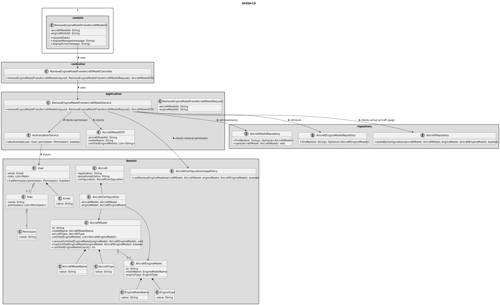
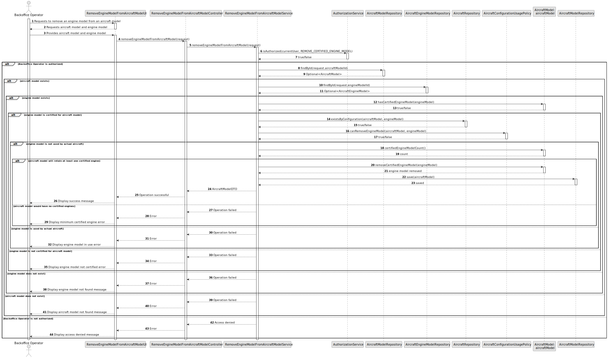

# US058 - Remove an Engine Model from an Aircraft Model

## 3. Design

### 3.1. Responsibility Assignment

The process of removing an engine model from an aircraft model is divided between the following components:

* **RemoveEngineModelFromAircraftModelUI:** interacts with the Backoffice Operator and collects the aircraft model and engine model.
* **RemoveEngineModelFromAircraftModelController:** receives the request from the UI.
* **RemoveEngineModelFromAircraftModelService:** coordinates authorization, lookup, usage validation and persistence.
* **AuthorizationService:** verifies if the current user has permission to manage aircraft models.
* **AircraftModelRepository:** retrieves and stores the aircraft model.
* **AircraftEngineModelRepository:** retrieves the selected aircraft engine model.
* **AircraftRepository:** checks whether actual aircraft are using the aircraft model and engine model combination.
* **AircraftModel:** aggregate root responsible for enforcing the certified engine list invariants.
* **AircraftEngineModel:** domain entity representing the engine model to be removed.
* **AircraftConfigurationUsagePolicy:** domain service or policy responsible for checking whether removal is allowed due to actual aircraft usage.

---

### 3.2. Class Diagram

---

### 3.3. Sequence Diagram

---

### 3.4. Applied Patterns

* **UI:** responsible for collecting input from the Backoffice Operator.
* **Controller:** receives and delegates the request.
* **Service:** coordinates the use case.
* **Repository:** abstracts persistence and lookup operations.
* **Aggregate Root:** `AircraftModel` protects the certified engine list.
* **Domain Policy:** `AircraftConfigurationUsagePolicy` centralizes the rule that prevents removal when actual aircraft use the configuration.
* **Entity:** represents aircraft models, engine models and actual aircraft.

---

### 3.5. Design Remarks

* The UI must not access repositories directly.
* The Controller should not contain business rules.
* The Service should coordinate lookup, authorization and usage checks.
* The AircraftModel aggregate should expose a method such as `removeCertifiedEngineModel(engineModel)`.
* The AircraftModel aggregate should prevent removing the last certified engine model.
* The system must check actual aircraft usage before removing certification.
* This operation should not delete aircraft models or engine models.