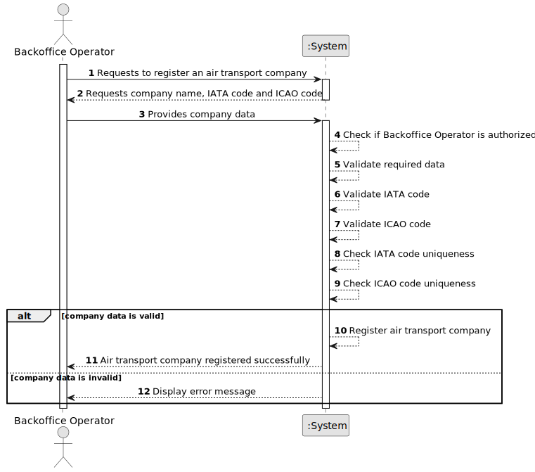

# US060 - Register an Air Transport Company

## 1. Requirements Engineering

### 1.1. User Story Description

As a Backoffice Operator, I want to register an air transport company.

This functionality allows a Backoffice Operator to register an air transport company in the system. Each company must have a name, an IATA code and an ICAO code. The IATA and ICAO codes must be unique in the system. The same registration must also be possible through a bootstrap process.

---

### 1.2. Customer Specifications and Clarifications

**From the specifications document:**

* AlSafe aims to offer the system globally.
* Air transport companies are not the direct client, but they use the system to register aircraft and flights.
* A Backoffice Operator can register air transport companies.
* An air transport company has a company name.
* An air transport company has an IATA code with 2 letters.
* An air transport company has an ICAO code with 2 to 3 letters.
* IATA and ICAO codes must be unique.
* Registering an air transport company must also be achievable by a bootstrap process.
* Authentication and authorization must be enforced for all users and functionalities.

**From the client clarifications:**

No additional client clarifications are currently available.

---

### 1.3. Acceptance Criteria

* **AC1:** The Backoffice Operator must be able to register a new air transport company.
* **AC2:** The company must have a name.
* **AC3:** The company must have an IATA code.
* **AC4:** The company must have an ICAO code.
* **AC5:** The IATA code must have exactly 2 letters.
* **AC6:** The ICAO code must have 2 to 3 letters.
* **AC7:** The IATA code must be unique in the system.
* **AC8:** The ICAO code must be unique in the system.
* **AC9:** The system must not register a company with missing required data.
* **AC10:** The system must not register a company with duplicated IATA or ICAO codes.
* **AC11:** Only an authenticated and authorized Backoffice Operator can register air transport companies.
* **AC12:** The system must support registering air transport companies through a bootstrap process.
* **AC13:** Bootstrap registration must follow the same validation rules as manual registration.

---

### 1.4. Found out Dependencies

* This user story depends on US030, because only authenticated and authorized users should be able to access this functionality.
* This user story is related to US061, because customer collaborators can only be added to registered customers.
* This user story is related to US070, because aircraft are added to an air transport company's fleet.
* This user story is related to US073, because flight routes belong to an air transport company.
* This user story is related to US075, because pilots belong to an air transport company.
* This user story is related to US080, because flight plans are created for routes belonging to air transport companies.

---

### 1.5. Input and Output Data

**Input Data:**

* Typed data:
    * Company name
    * IATA code
    * ICAO code

**Optional Input Data:**

Depending on future refinement, the company may also include:

* Country
* Contact email
* Headquarters location
* Operational status

**Output Data:**

* In case of success:
    * Success message
    * Registered air transport company information

* In case of failure:
    * Error message explaining why the air transport company could not be registered

---

### 1.6. System Sequence Diagram

**_Other alternatives might exist._**

---

### 1.7. Other Relevant Remarks

* Air transport companies are not the direct client of AlSafe, but they interact with the system to register aircraft, routes and pilots.
* IATA and ICAO codes should be treated as stable identifiers.
* Bootstrap registration and manual registration should reuse the same validation rules.
* The company entity should later support collaborators, aircraft fleet, pilots and flight routes.