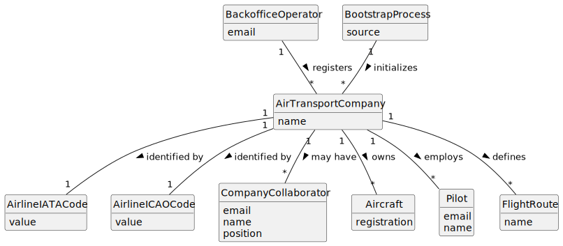

# US060 - Register an Air Transport Company

## 2. Analysis

### 2.1. Relevant Domain Concepts

The relevant domain concepts for this user story are:

* **Backoffice Operator:** user responsible for registering base system information.
* **Air Transport Company:** company that uses the system to register aircraft, routes, pilots and flights.
* **Company Name:** human-readable name of the air transport company.
* **Airline IATA Code:** 2-letter code identifying the air transport company.
* **Airline ICAO Code:** 2-3 letter code identifying the air transport company.
* **Bootstrap Process:** initialization mechanism that can register default air transport companies automatically.

---

### 2.2. Business Rules

* Only an authorized Backoffice Operator can register air transport companies.
* An air transport company must have a name.
* An air transport company must have an IATA code.
* An air transport company must have an ICAO code.
* The IATA code must have exactly 2 letters.
* The ICAO code must have 2 to 3 letters.
* The IATA code must be unique in the system.
* The ICAO code must be unique in the system.
* An air transport company cannot be registered if required data is missing.
* An air transport company cannot be registered if its IATA or ICAO code already exists.
* Bootstrap registration must follow the same validation rules as manual registration.
* A registered air transport company may later have collaborators, aircraft, pilots and flight routes.

---

### 2.3. Preconditions

* The Backoffice Operator must be authenticated.
* The Backoffice Operator must be authorized to register air transport companies.
* Required company data must be available.

---

### 2.4. Postconditions

**Successful registration:**

* A new air transport company is created.
* The company is stored in the system.
* The company can later have collaborators, aircraft, pilots and routes associated with it.

**Failed registration:**

* No company is created.
* The system state remains unchanged.
* An error message is displayed.

---

### 2.5. Domain Model

