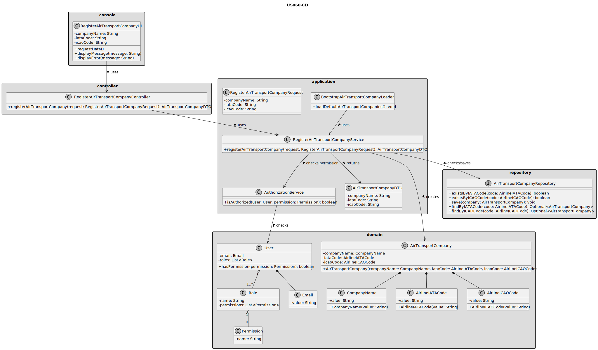
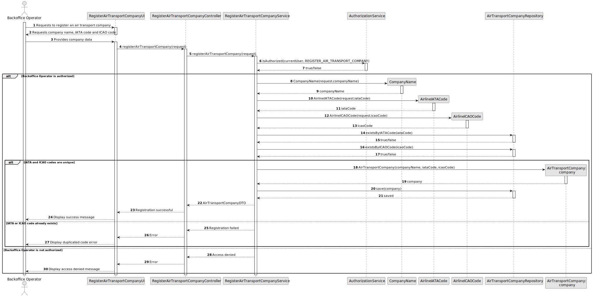

# US060 - Register an Air Transport Company

## 3. Design

### 3.1. Responsibility Assignment

The air transport company registration process is divided between the following components:

* **RegisterAirTransportCompanyUI:** interacts with the Backoffice Operator and collects company data.
* **RegisterAirTransportCompanyController:** receives the registration request from the UI.
* **RegisterAirTransportCompanyService:** coordinates authorization, validation and persistence.
* **AuthorizationService:** verifies if the current user has permission to register air transport companies.
* **AirTransportCompanyRepository:** checks IATA/ICAO uniqueness and stores the new company.
* **AirTransportCompany:** domain entity representing the company.
* **CompanyName:** value object representing the company name.
* **AirlineIATACode:** value object representing the 2-letter airline IATA code.
* **AirlineICAOCode:** value object representing the 2-3 letter airline ICAO code.
* **BootstrapAirTransportCompanyLoader:** supports initial creation of air transport companies during bootstrap.

---

### 3.2. Class Diagram

---

### 3.3. Sequence Diagram

---

### 3.4. Applied Patterns

* **UI:** responsible for collecting input from the Backoffice Operator.
* **Controller:** receives and delegates the request.
* **Service:** coordinates the use case.
* **Repository:** abstracts persistence and uniqueness checks.
* **Entity:** represents air transport companies.
* **Value Object:** represents company name, IATA code and ICAO code.
* **Bootstrap Loader:** supports automatic initialization of default companies.

---

### 3.5. Design Remarks

* The UI must not access repositories directly.
* The Controller should not contain business rules.
* The Service should coordinate authorization and persistence.
* IATA and ICAO code validation should be handled by value objects.
* The repository should verify uniqueness of IATA and ICAO codes.
* Bootstrap registration should reuse the same validation rules as manual registration.
* The company aggregate should later be extended to support collaborators, aircraft fleet, pilots and flight routes.