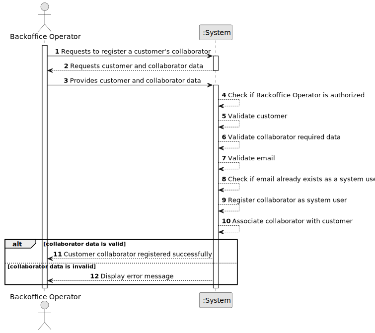

# US061 - Add a Customer's Collaborator

## 1. Requirements Engineering

### 1.1. User Story Description

As a Backoffice Operator, I want to register a customer's collaborator.

This functionality allows a Backoffice Operator to add a collaborator to a customer registered in the system. A customer may be an air transport company or an air control area. The collaborator is also a system user, meaning that each collaborator must correspond to a distinct user account.

---

### 1.2. Customer Specifications and Clarifications

**From the specifications document:**

* A customer may be an air transport company or an air control area.
* A Backoffice Operator can add a customer's collaborator.
* The collaborator will also be a user of the system.
* Each collaborator will be a distinct system user.
* There is no need to verify that the collaborator's email is in the customer's domain.
* Many users may have emails outside the company's main domain.
* A collaborator should have email, name and position.
* The set of active collaborators will change over time.
* This must also be achievable by a bootstrap process.
* Authentication and authorization must be enforced for all users and functionalities.

**From the client clarifications:**

No additional client clarifications are currently available.

---

### 1.3. Acceptance Criteria

* **AC1:** The Backoffice Operator must be able to register a collaborator for a customer.
* **AC2:** The customer must exist in the system.
* **AC3:** The customer may be an air transport company or an air control area.
* **AC4:** The collaborator must have an email.
* **AC5:** The collaborator must have a name.
* **AC6:** The collaborator must have a position.
* **AC7:** The collaborator must also be registered as a distinct system user.
* **AC8:** The collaborator email must be unique among system users.
* **AC9:** The system must not require the collaborator email to belong to the customer's domain.
* **AC10:** The collaborator must be associated with the selected customer.
* **AC11:** The collaborator must be active after successful registration.
* **AC12:** The system must not register a collaborator if required data is missing.
* **AC13:** Only an authenticated and authorized Backoffice Operator can register customer collaborators.
* **AC14:** The system must support registering customer collaborators through a bootstrap process.
* **AC15:** Bootstrap registration must follow the same validation rules as manual registration.

---

### 1.4. Found out Dependencies

* This user story depends on US030, because only authenticated and authorized users should be able to access this functionality.
* This user story depends on US031, because a collaborator is also a system user.
* This user story depends on US050, when the customer is an air control area.
* This user story depends on US060, when the customer is an air transport company.
* This user story is related to US062, because customer collaborators must later be listable.
* This user story is related to US063, because collaborator email and phone number may later be edited.
* This user story is related to US064, because collaborators may later be disabled.

---

### 1.5. Input and Output Data

**Input Data:**

* Selected data:
    * Customer type
    * Customer

* Typed data:
    * Collaborator email
    * Collaborator name
    * Collaborator phone number
    * Collaborator position

**Output Data:**

* In case of success:
    * Success message
    * Registered collaborator information
    * Associated system user information

* In case of failure:
    * Error message explaining why the collaborator could not be registered

---

### 1.6. System Sequence Diagram

**_Other alternatives might exist._**

---

### 1.7. Other Relevant Remarks

* The collaborator must be a system user.
* The collaborator email must be unique as a user identifier.
* The system must not validate whether the collaborator email belongs to the customer's domain.
* The customer abstraction may represent either an air transport company or an air control area.
* Bootstrap registration and manual registration should reuse the same validation rules.