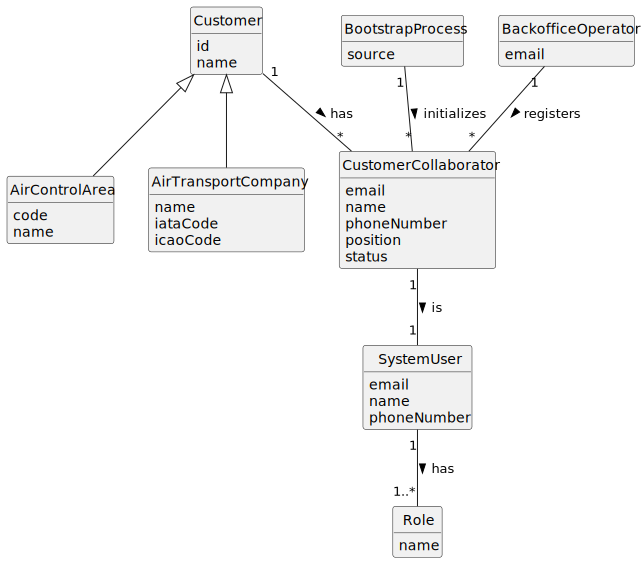

# US061 - Add a Customer's Collaborator

## 2. Analysis

### 2.1. Relevant Domain Concepts

The relevant domain concepts for this user story are:

* **Backoffice Operator:** user responsible for registering customer collaborators.
* **Customer:** entity that may be an air transport company or an air control area.
* **Air Transport Company:** customer type that may have collaborators.
* **Air Control Area:** customer type that may have collaborators.
* **Customer Collaborator:** person associated with a customer and allowed to interact with the system.
* **System User:** user account required for authentication and authorization.
* **Email:** unique identifier of the system user.
* **Position:** collaborator's role or position within the customer's organization.
* **Bootstrap Process:** initialization mechanism that can register default collaborators automatically.

---

### 2.2. Business Rules

* Only an authorized Backoffice Operator can register a customer's collaborator.
* The customer must exist.
* A customer may be an air transport company or an air control area.
* A collaborator must also be a distinct system user.
* A collaborator must have an email.
* A collaborator must have a name.
* A collaborator must have a phone number.
* A collaborator must have a position.
* The collaborator email must be unique among system users.
* The system must not require the collaborator email to belong to the customer's domain.
* The collaborator must be associated with exactly one selected customer at registration.
* The collaborator should be active after registration.
* Bootstrap registration must follow the same validation rules as manual registration.

---

### 2.3. Preconditions

* The Backoffice Operator must be authenticated.
* The Backoffice Operator must be authorized to register customer collaborators.
* The selected customer must exist.
* Required collaborator data must be available.
* The collaborator email must not already be used by another system user.

---

### 2.4. Postconditions

**Successful registration:**

* A new system user is created for the collaborator.
* A new customer collaborator is created.
* The collaborator is associated with the selected customer.
* The collaborator is active.
* The collaborator may later authenticate if all access conditions are valid.

**Failed registration:**

* No collaborator is created.
* No new system user is created.
* The customer remains unchanged.
* An error message is displayed.

---

### 2.5. Domain Model

