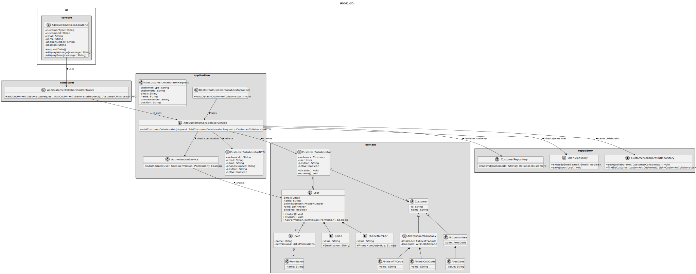
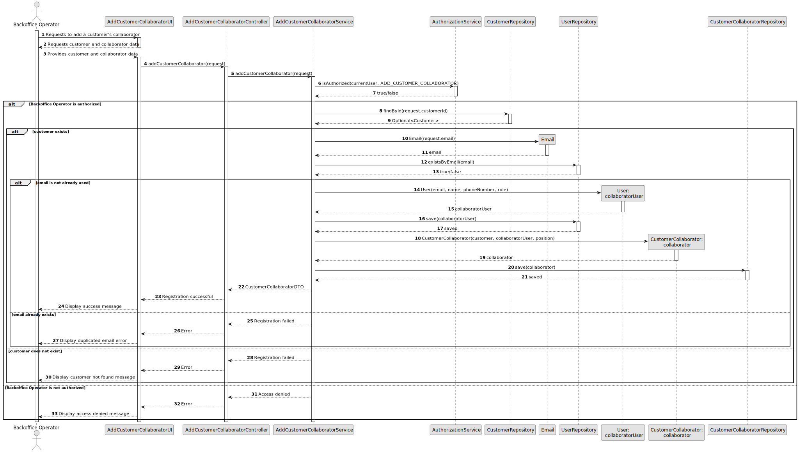

# US061 - Add a Customer's Collaborator

## 3. Design

### 3.1. Responsibility Assignment

The customer collaborator registration process is divided between the following components:

* **AddCustomerCollaboratorUI:** interacts with the Backoffice Operator and collects customer and collaborator data.
* **AddCustomerCollaboratorController:** receives the registration request from the UI.
* **AddCustomerCollaboratorService:** coordinates authorization, validation, user creation and customer association.
* **AuthorizationService:** verifies if the current user has permission to register customer collaborators.
* **CustomerRepository:** retrieves the selected customer, whether it is an air transport company or an air control area.
* **UserRepository:** checks email uniqueness and stores the new system user.
* **CustomerCollaboratorRepository:** stores the collaborator association.
* **CustomerCollaborator:** domain entity representing the collaborator.
* **User:** domain entity representing the corresponding system user.
* **Email:** value object representing the collaborator/user email.
* **BootstrapCustomerCollaboratorLoader:** supports initial creation of customer collaborators during bootstrap.

---

### 3.2. Class Diagram

---

### 3.3. Sequence Diagram

---

### 3.4. Applied Patterns

* **UI:** responsible for collecting input from the Backoffice Operator.
* **Controller:** receives and delegates the request.
* **Service:** coordinates the use case.
* **Repository:** abstracts customer, user and collaborator persistence.
* **Entity:** represents users, customers and collaborators.
* **Value Object:** represents email and phone number.
* **Polymorphism / Generalization:** customer may be an air transport company or an air control area.
* **Bootstrap Loader:** supports automatic initialization of default collaborators.

---

### 3.5. Design Remarks

* The UI must not access repositories directly.
* The Controller should not contain business rules.
* The Service should coordinate both user creation and collaborator association.
* The collaborator must be created as a system user.
* The system must not validate the collaborator email against the customer's domain.
* Email uniqueness should be checked at system user level.
* Bootstrap registration should reuse the same validation rules as manual registration.