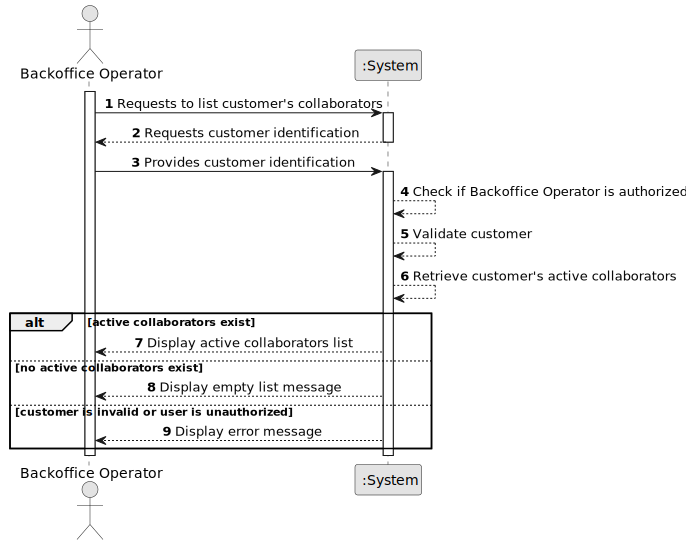

# US062 - List Customer's Collaborators

## 1. Requirements Engineering

### 1.1. User Story Description

As a Backoffice Operator, I want to list all collaborators of a given customer.

This functionality allows a Backoffice Operator to consult the active collaborators associated with a selected customer. A customer may be an air transport company or an air control area. Disabled collaborators must not be included in the result.

---

### 1.2. Customer Specifications and Clarifications

**From the specifications document:**

* A customer may be an air transport company or an air control area.
* An air transport company may have several collaborators interacting with the system.
* The set of active collaborators will change over time.
* A collaborator has email, name and position.
* A Backoffice Operator can list all collaborators of a given customer.
* Disabled collaborators should not be listed.
* Authentication and authorization must be enforced for all users and functionalities.

**From the client clarifications:**

No additional client clarifications are currently available.

---

### 1.3. Acceptance Criteria

* **AC1:** The Backoffice Operator must be able to list collaborators of a given customer.
* **AC2:** The selected customer must exist in the system.
* **AC3:** The customer may be an air transport company or an air control area.
* **AC4:** The list must include only active collaborators.
* **AC5:** Disabled collaborators must not be displayed.
* **AC6:** The list must include each collaborator's email.
* **AC7:** The list must include each collaborator's name.
* **AC8:** The list must include each collaborator's position.
* **AC9:** If the customer has no active collaborators, the system must display an appropriate empty list message.
* **AC10:** Only an authenticated and authorized Backoffice Operator can list customer collaborators.
* **AC11:** The listing operation must not modify collaborator data.

---

### 1.4. Found out Dependencies

* This user story depends on US030, because only authenticated and authorized users should be able to access this functionality.
* This user story depends on US061, because collaborators must be registered before they can be listed.
* This user story depends on US050, when the selected customer is an air control area.
* This user story depends on US060, when the selected customer is an air transport company.
* This user story is related to US064, because disabled collaborators must not appear in this list.

---

### 1.5. Input and Output Data

**Input Data:**

* Selected data:
    * Customer type
    * Customer

**Optional Input Data:**

Depending on future refinement, the listing may support:

* Collaborator position
* Collaborator name
* Sorting criteria

**Output Data:**

* In case active collaborators exist:
    * List of active customer collaborators, including:
        * Email
        * Name
        * Position

* In case no active collaborators exist:
    * Empty list message

* In case of failure:
    * Error message explaining why the collaborator list could not be displayed

---

### 1.6. System Sequence Diagram

**_Other alternatives might exist._**

---

### 1.7. Other Relevant Remarks

* This is a read-only user story.
* Disabled collaborators should remain stored in the system but must not be displayed in this listing.
* The customer abstraction may represent either an air transport company or an air control area.
* The listing should not expose unnecessary internal user information.