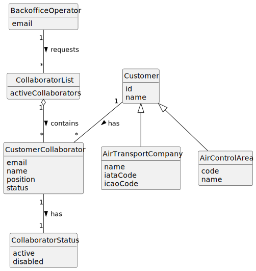

# US062 - List Customer's Collaborators

## 2. Analysis

### 2.1. Relevant Domain Concepts

The relevant domain concepts for this user story are:

* **Backoffice Operator:** user responsible for consulting customer collaborator information.
* **Customer:** entity that may be an air transport company or an air control area.
* **Air Transport Company:** customer type that may have collaborators.
* **Air Control Area:** customer type that may have collaborators.
* **Customer Collaborator:** collaborator associated with a customer.
* **Collaborator Status:** indicates whether the collaborator is active or disabled.
* **System User:** user account associated with the collaborator.
* **Collaborator List:** result containing the active collaborators of a selected customer.

---

### 2.2. Business Rules

* Only an authorized Backoffice Operator can list customer collaborators.
* The selected customer must exist.
* A customer may be an air transport company or an air control area.
* Only active collaborators must be listed.
* Disabled collaborators must not be displayed.
* The listing operation must not modify customer or collaborator data.
* If the customer has no active collaborators, the system must return an empty list or an appropriate message.
* The result should include collaborator email, name and position.

---

### 2.3. Preconditions

* The Backoffice Operator must be authenticated.
* The Backoffice Operator must be authorized to list customer collaborators.
* The selected customer must exist.

---

### 2.4. Postconditions

**Successful listing with active collaborators:**

* The system displays the active collaborators of the selected customer.
* The system state remains unchanged.

**Successful listing without active collaborators:**

* The system displays an empty list message.
* The system state remains unchanged.

**Failed listing:**

* No collaborator list is displayed.
* The system state remains unchanged.
* An error message is displayed.

---

### 2.5. Domain Model

