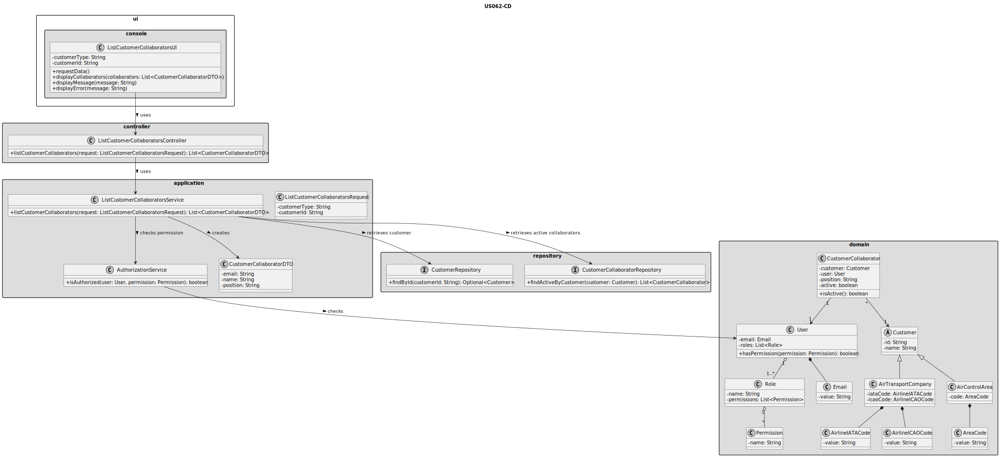
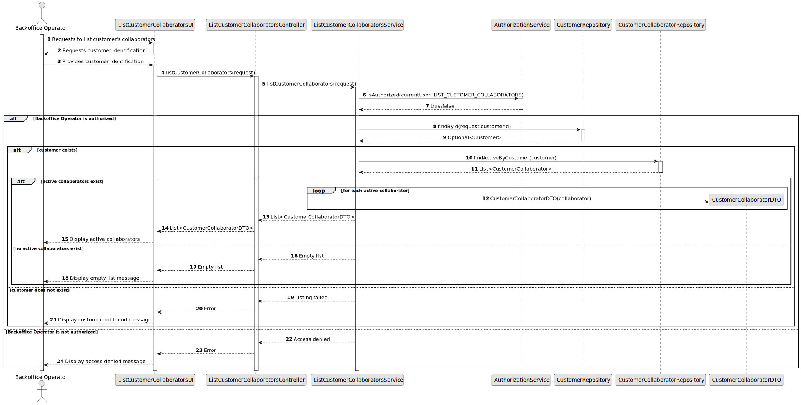

# US062 - List Customer's Collaborators

## 3. Design

### 3.1. Responsibility Assignment

The customer collaborator listing process is divided between the following components:

* **ListCustomerCollaboratorsUI:** interacts with the Backoffice Operator and collects the selected customer.
* **ListCustomerCollaboratorsController:** receives the list request from the UI.
* **ListCustomerCollaboratorsService:** coordinates authorization, customer lookup and collaborator retrieval.
* **AuthorizationService:** verifies if the current user has permission to list customer collaborators.
* **CustomerRepository:** retrieves the selected customer, whether it is an air transport company or an air control area.
* **CustomerCollaboratorRepository:** retrieves active collaborators associated with the selected customer.
* **CustomerCollaboratorDTO:** transports collaborator information to the UI.
* **CustomerCollaborator:** domain entity representing the collaborator.

---

### 3.2. Class Diagram

---

### 3.3. Sequence Diagram

---

### 3.4. Applied Patterns

* **UI:** responsible for collecting input and displaying collaborators.
* **Controller:** receives and delegates the request.
* **Service:** coordinates authorization and data retrieval.
* **Repository:** abstracts customer and collaborator lookup.
* **DTO:** transfers collaborator data to the UI.
* **Polymorphism / Generalization:** customer may be an air transport company or an air control area.

---

### 3.5. Design Remarks

* The UI must not access repositories directly.
* The Controller should not contain business rules.
* The Service should coordinate authorization and retrieval.
* Disabled collaborators must be filtered out.
* The listing operation must be read-only.
* The DTO should expose only the information needed by the UI.